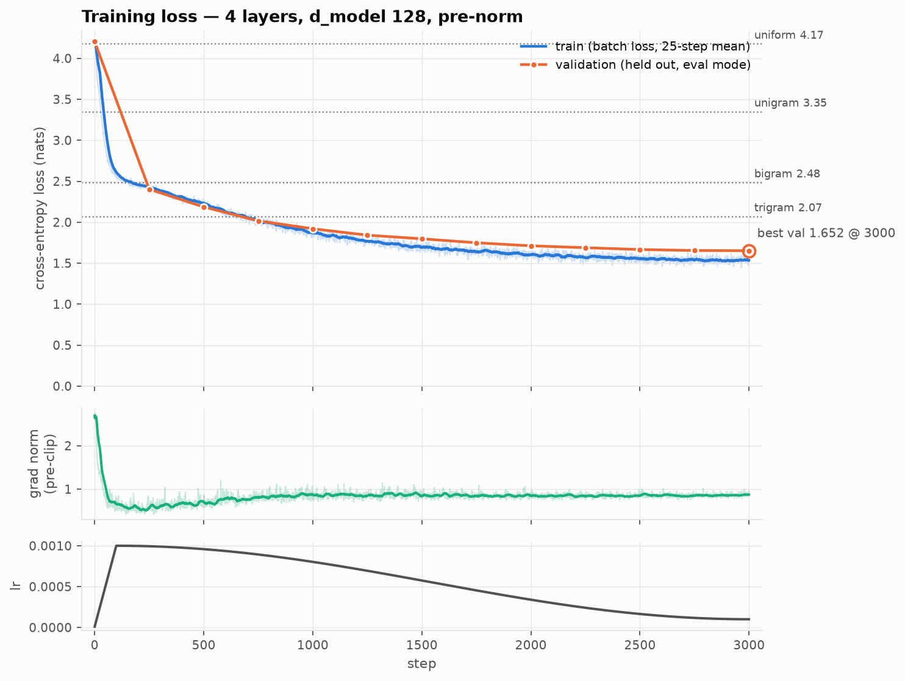
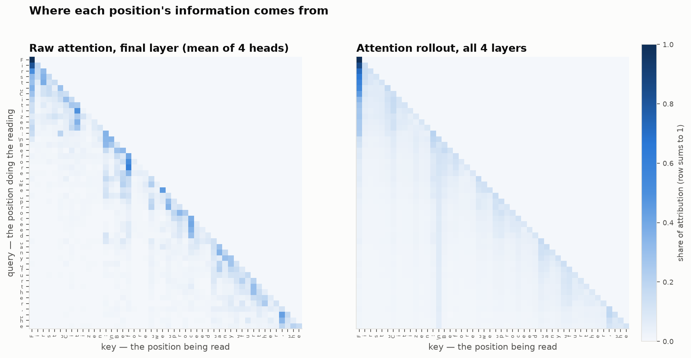
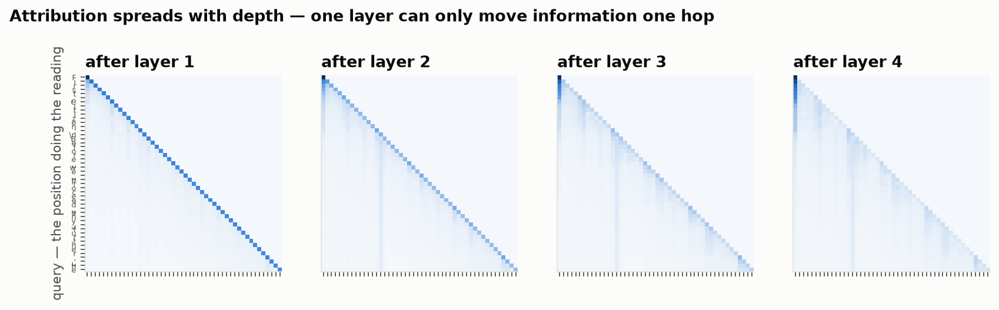
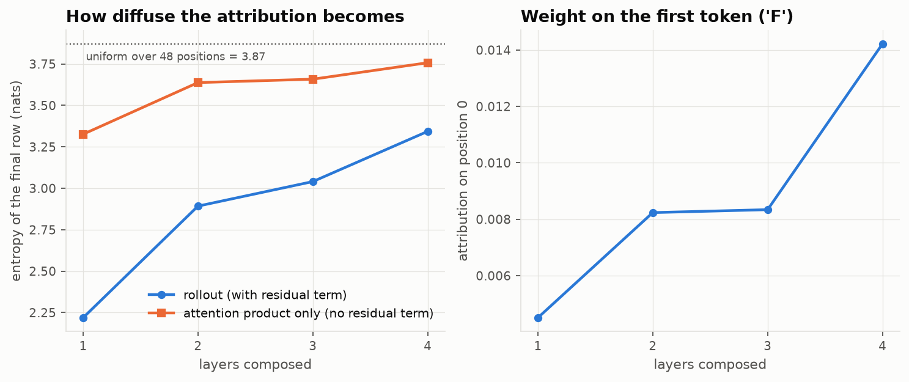

# Week 4 - Transformer Architecture

## What I Built

A decoder-only transformer trained from scratch on character-level tiny Shakespeare. The character level training was done to ensure the model was on level playing field with the 3 baseline models used. Baseline where set using the Unigram, Bigram, and trigram models. I order to conclude the decoder-only model actually learned it needed to perform better than all of these models. These models cross entropy losses on the corpus where 3.34, 2.48 and 2.068 for the trigram model. After 3000 steps the decoder-only model scored a loss of 1.65 on the validation step which is .417 nats lower than the trigram model. This proves the model was able to learning meaningful relationships within the data which couldn't be captured by a trigram model which uses the 2 previous tokens to make predictions. This loss corresponds to a probability of .19 which is a 12x increase the the uniform. This means on average the model assigned the correct character a probability of .19.

Within this decoder architecture are two main peices which make up each transformer block. The attention layer which used the previous weeks code and the FFN (Forward Feed Network). The attention layer moves information between tokens and the FFN moves information within a token. The FFN is responsible for the non linear transformation and uses a GELU activation function. The LayerNorm is the other peice which is included within the block. This layer operates on each token individually by subtracting by it's mean and dividing by it's biased standard deviation. This result is than multiplied by a trainable vector which initializes to all 1's and lastly a bias term is added. This layer is responsible for removing the magnitude from the vectors so that all calculations are based soley on direction of the vector. The layer norm is responsible for keeping the gradient from exploding. The next peice is the residual-connection. After each sublayer the results are added to the residual connection. This ensures that the inputs signal survives through deep layers of a decoder model. Without it the inputs signal would completely disapear and the results would converge to uniform sampling. The Architure uses pre-norm but supports post-norm as well with default warmup which is necessary for post-norm models. Outside of the tranformer block torchs embedding model was used for both the semantic and positional embeddeds. After the residual has gone through all of the layers it's then passed into one more LayerNorm function and then reaches the LM_head function which maps the results to logits which are used to predict the next token. The LM_head weights where tied with the embedding matrix to save parameters. The logits are then passed into the cross_entropy function which compares the predictions against the true next token for every token with the sequence. For the gradient descent the AdamW optimizer was used instead of SGD because SGD only supports one learning rate across all parameters where as AdamW calculates learned rates for each parameter individually which is extremely important given that weights can differ by a large margin within the decoder. This doesn't come without it's costs though as AdamW keeps the first and second moment for each parameter which means we have to store those values throughout training which can be costly especially as the model parameters increase.


## Architecture

### Diagram

Config: `V=65  block_size=128  n_layer=4  n_head=4  d_model=128  d_k=32  d_ff=512`
Shapes shown for a training batch `B=32, T=128`. Total parameters: 818,048.

#### The pre-norm transformer block

```
                  ┌──────────── residual stream ─────────────┐
                  │            (B, T, 128)                    │
  in ─────────────●───────────────────────────●───────────────●────▶ out
  (B,T,128)       │                           ▲               ▲   (B,T,128)
                  │                           │               │
                  ├──▶ LayerNorm ln1 ─────────┤               │
                  │    (B,T,128)              │               │
                  │         │                 │               │
                  │         ▼                 │               │
                  │    Multi-Head Attention   │               │
                  │    ┌──────────────────┐   │               │
                  │    │ W_q W_k W_v      │   │               │
                  │    │  (B,T,128) each  │   │               │
                  │    │ split → 4 heads  │   │               │
                  │    │  (B,4,T,32)      │   │               │
                  │    │ QKᵀ/√32 + mask   │   │               │
                  │    │  (B,4,T,T)       │   │               │
                  │    │ softmax @ V      │   │               │
                  │    │  (B,4,T,32)      │   │               │
                  │    │ merge → (B,T,128)│   │               │
                  │    │ W_o              │   │               │
                  │    └────────┬─────────┘   │               │
                  │             └─────────────┘  add          │
                  │                                           │
                  └──▶ LayerNorm ln2 ──▶ FFN ─────────────────┘  add
                       (B,T,128)         ┌─────────────────┐
                                         │ fc_in  128→512  │
                                         │ GELU            │
                                         │ fc_out 512→128  │
                                         └─────────────────┘

  MIXES ACROSS POSITIONS: attention only.   MIXES ACROSS FEATURES: the FFN only.
  The stream is never normalized and never replaced — only added to.
  Parameters per block: 198,272  =  attention 66,048 (33%) + FFN 131,712 (67%) + LNs 512
```

#### The full decoder-only model

```
  token ids                                   (32, 128)   int64
      │
      ├─▶ tok_emb   nn.Embedding(65, 128)     (32, 128, 128)      8,320 params
      ├─▶ pos_emb   nn.Embedding(128, 128)    (   128, 128)      16,384 params
      │              broadcast over batch
      ▼
  x = dropout(tok + pos)                      (32, 128, 128)  ← stream starts
      │
      │   causal mask (128, 128), True = allowed, lower-triangular, shared by all blocks
      │
      ├─▶ block 1 ──┐
      ├─▶ block 2   │  identical shape in and out,
      ├─▶ block 3   │  so depth is a loop counter
      ├─▶ block 4 ──┘                         (32, 128, 128)   793,088 params
      ▼
  ln_f   final LayerNorm                      (32, 128, 128)        256 params
      │   pins every token to mean 0, norm √128 = 11.31
      ▼
  lm_head  Linear(128, 65, bias=False)        (32, 128, 65)          0 params (tied
      │    weight IS tok_emb.weight                                  to tok_emb)
      │    logit[b,t,v] = ⟨ln_f(x)[b,t], W_E[v]⟩
      ▼
  cross_entropy(logits.view(-1, 65),          (4096, 65)
                targets.reshape(-1))          (4096,)      → scalar loss
                                              4,096 = 32 × 128 independent predictions
```

#### Training vs generation — the same weights, two execution patterns

```
TRAINING (parallel, teacher-forced)         GENERATION (sequential)
  x: a real slice of the corpus               idx: prompt + its own output so far
  y = x shifted left by one                   no targets
       ↓                                           ↓
  ONE forward → logits (B,T,65)               forward → logits (1,T,65)
  ALL T positions supervised                  keep [:, -1, :] → (1,65), DISCARD T−1
       ↓                                           ↓
  loss → backward → clip → step                / temperature → top-k → softmax
  dropout ON, gradients ON                     multinomial → (1,1) → cat
                                               crop idx[:, -128:]  ← the context limit
                                               dropout OFF, no_grad
  1 forward per 4,096 predictions             1 forward per 1 token
```

### Decisions, and why

    - The architecture uses pre-norm normalization which preserves the identity matrix and controls the gradient step. This was choosen not because post norm doesn't work but because it requires much less fine tuning of the hyperparameters where as with post-norm your warmup value is extremely important in order to control the step size within early iterations.

    - Learned positional encodings where used instead of sinusoidal encodings to increase the flexability within the embedding space. With Learned positional encodings extrapolation isn't possible since a max sequence length must be set. Although sinusiodal encodings allow for extropalation it has been observed that sequence lengths beyhond the length used during training leads to very poor results. Neither of these techniques are used within modern LLMs as RoPE has been adopted which combines the two techniques into one transformation which rotates the Q and K matrices according to the token positions.

    - d_ff was defined as 4 x d_model which is standard practice. This additional dimensionality allows for more complex non linear transformations within the activation function. And is the reason why the FFN upscales the matrix before the activation and then downscales it before updating the residual stream.

    - The GeLU activation function was used because it allows for better gradient stability compared to the ReLU function which is 0 for all negative weights.

### Why Residuals and LayerNorm matter

The residual connection and LayerNorms are two very important peices of the Tranformer block. The Residual connection also called the residual bus means that the values are never overriden the results of each sub-layer are simply added to the input. Without the residual block the input signal doesn't survive the layers within the model. This can be tested using a peterb test where you change the input and measure how much of the changes signal can be detected within the layers. This test will show that the signal completely disappears and the output becomes completely independent of the input. Without the residual connection the models loss will platue around the same loss as the unigram model which simply predicts the next token based on the frequencies within the corpus and it's safe to say that's not the kind of performance we are looking for when using an extreme amount of compute to train a model. The LayerNorm serves a different purpose. The residual connection adds each sublayers output back to the input this causes the gradient to explode. LayerNorm fixes this issue by normalizing the vectors before they are inputted the any sub-layer which means each sub-layer is completely blind to the actual magnitude of the vector and only sees it's direction. This stabalizes the gradient and keeps it from exploding.

## Code

Repo: https://github.com/dgrim3434/FDE-Curriculum/tree/main/week_04_transformer

**Feed Forward Network**
```python
class Forward_Feed_Network(nn.Module):
    
    def __init__(self, d_model, d_ff = None, dropout = 0.0, bias=True):
        
        super().__init__()
        d_ff = d_model * 4 if d_ff is None else d_ff
        
        self.fn_u = nn.Linear(d_model, d_ff, bias=bias)
        self.fn_l = nn.Linear(d_ff, d_model, bias=bias)
        self.activation = nn.GELU(approximate='tanh')
        
        self.dropout = nn.Dropout(dropout)
        
    def forward(self, x):
        
        return self.dropout(self.fn_l(self.activation(self.fn_u(x))))
```

**Transformer Block**
```python
class Transformer_Block(nn.Module):
    
    def __init__(self, d_model, num_heads, d_ff = None, bias=True, dropout = 0.0, norm='pre'):
        
        super().__init__()
        
        if norm not in set(['pre', 'post']):
            raise ValueError("ERROR: Invalid input for parameter: norm. Must be either 'pre' or 'post' ")
        
        self.norm = norm
        self.ln1 = nn.LayerNorm(d_model)
        self.ln2 = nn.LayerNorm(d_model)
        
        self.attention = Multi_Head_Attention(d_model, num_heads, dropout, bias)
        self.ffn = Forward_Feed_Network(d_model, d_ff, dropout, bias)
    
    def forward(self, x, mask = None, return_att = False):
        
        if self.norm == 'pre':
            
            y, w = self.attention.forward(self.ln1(x), mask=mask)
            x = x + y
            
            x = x + self.ffn.forward(self.ln2(x))
        else:
            
            y, w = self.attention.forward(x, mask = mask)
            x = self.ln1(x + y)
            
            x = self.ln2(x + self.ffn.forward(x))
        
        if return_att:
            return (x, w)
        
        return (x, None)
```

## Demo
----- step 0 -----

m$CdNvm!!pR!QAl?m!LcYccwaV:Um,lAj.ORTNeIPuoawvFcQN' dzHGk!!jM:xj&Z'D;.nAzp-KwzHWAPnUEA3OmlLLtAh&Oz -t,,bqf!qc,ggzm;-iBR-$xKHZVuPys&gyyUPF.DJcw?AkEmcSxPcLQOynCXFAhpIeD;E-m.MNm;KjLMmoY?:wN,bXzKJveL'KK'sxMHHBHuYKCcNrQfy-GWSDm;CYJF!hNiKC:D,'WERMb$J&hui&cy?XAd:wGBTSynGUUEgM n
;MxcUoS3Y$kDE:C&doRq3vi!Kn Q

----- step 500 -----

PUS:
Hot the nat wat ke hidat muliongs: the heros the
Wo o swerting lengat is fillert;
What she wan the wosted anrre, ive tosf ea my tofthe
And thof peeerutiresther iseik ancin ang therint:
Than swe ge feimererere anead; a bot ang.


IOMERCENTHERD:
Yoped wimeld, lortere myou lou aur there thore hof

----- step 1500 -----

His so he before your shand'd tood breath,
And rever a have soldes in the is do kindreent
the of his -

DUKE VINCENTIO:
Why, is straitor, his countion a it but ready,
How sir them can tell of the dreath, 'twill unage them,
Or he as in bege the happe of me.

LEORD OV:
My subje, for Let and constoron 

----- step 3000 -----

Edward my breath, and speak to my find:
Prince, for thy death, do hand I, give scrain her
In his of tree subject more knife the comfort
To him fear than husbands strike all her
As fear'd woe her this becoment of gracious
Than in the than I sue dead, as the did him maids:
For he with is a falter thou


## Visualizations

### Training Loss Curve



**What it shows.** This pane has three different graphs. The first one is the Loss curve which shows how the loss changes throughout the training run. The y-axis represents the loss in nats and the x-axis holds the training steps. There are two lines within the graph the most important one is the orange line which shows how the loss on the validation set changes throughout the training process. There are also horizontal lines which represent how the baseline models performed on the dataset. The uniform, unigram, bigram, and trigram performance where all plotted to provide a reference for how different kinds of models scored. The second graph shows the pre-normalization gradients value on the y-axis and the x-axis shows the step. This graph is important because we want to know how often our gradient is being clipped. The third graph shows the learning rate value on the y-axis and the step on the x-axis. These two additional plots allow you to get a better understanding of why specific things might be happening within the loss curve. For example if the loss curve stabilizes and this matches up with when the learning rate has significantly decrease we know that the learning rate is likely causing the loss to level off.

**When to reach for it.** This visualization allows you to inspect and debug how the model is learning throughout the training block. This visualization answers a couple of questions: do the train and validation metrics trend in the same direction, does the loss oscilate, are there large spikes within the loss, does the gradient get clipped often, does the loss diverge.

**What to look for.**
    - Does the loss steadily decrease or is it jagged? If you see a jagged pattern you likely are working with to small of batches which is causing noisy gradients.
    - Do the train and validation decrease together? If not your model is begining to overfit the data which is why we use checkpoints to save the current best model.
    - Does the loss platue in a specific area? Can be a sign of a but within the pipeline depending on the platue area. Many of the transformer bugs will cause a platue at the unigram loss.

### Attention rollout





**What it shows.** The rollout heatmaps allow you to get a better understanding of which words are having the largest impact on the output. On the vertical axis you have tokens and each row corresponds to the weights the attention layer attributed to that token. The horizontal axis represents the tokens information. The way this should be read is that the token on the vertical recieves information from the token on the horizontal with each cell representing how much information is shared. The darker the cell the greater the weight. The rollout is different from the generic attention heatmap because it calculates the releative weight of each token based on how the information has moved within previous layers. For every layer we take the mean of the heads to represent that layers attention. We then multiply the matrix by .5 and add .5 of the identity matrix this gives is A^. We then caclulate the Ri from the formula Ri = A^i @ Ri-1 where R0 = I.

**When to reach for it.** This visualization should only be used for hypothesis formulation as it doesn't allow you to conclude which token truely has the most impact on the output which can only be done through ablation. When compared against the results of ablation if the two are consistant the visualization allows you to get a very good understanding of which tokens have the most affect.

**What to look for.**
    - Rows should sum to 1
    - The first row should only have weight on itself
    - The upper triangle shouldn't have any attributed weight
    - Specific tokens with large weights

**Limitations.** Within the attention rollup computation only the weights are used but within the actual attention layer the weights are multiplied by vectors. So in order to truely understand how much a token contributes you must know the weight and the value vector. A large weight multiplied against a small vector produces a small contribution. There are three levels which can be used in answering the question of which tokens where most important when coming up with the output. The first is the rollup attention heatmap which costs you additional storage since attention weights for all layers must be stored. This allows for hypothesis to be generated but cannot answer the question by itself. The second level is also storing the ||v|| for each weight and multiplying the weight by the norm of it's vector. This is better than the attention rollup on it's own but still won't provide you with the answer. The only way for the question to be fully answered is through ablation testing where you loop through the prompt replacing one token at a time with a space and measuring how much the output changed. This is the most expensive of the 3 options since you will need a forward pass for each prompt iteration but is the only one that fully answers the question.

## What I learned 

    - The AdamW optimizer allows for learning rates to be calibrated to each parameter. Takes up a lot of memory with two extra weights needing to be stored per parameter.
    - Although the training happens in parellel the generation happens completely in sequence with each new token being appended to the prompt. This is why KV caching is so important.
    - The first couple of tokens are extremely important for performance and none of it has to do with the information they hold. When you reach the block_length removing the first tokens severely degrades the performance because you removed the models sink which forces the softmax to find somewhere else to store the weights.
    - Within the FFN we increase the matrixes dimensions to allow for greater flexability within the activation function.

## Questions

    - When it comes to fine tuning I understand that we freeze many of the weights. We have already gone over heads being pruned and I wonder which weights are most often left for fine-tuning.
    - With KV caches is everything cached after the first iteration through the generation process? And then we only run the appended token through the model? And is the KV cache passed in like context would be in cross-attention.
