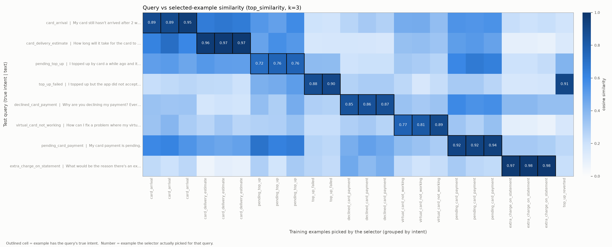

# Week 5 Submission — Prompting Foundations

## What I Built

A small prompting library plus the experiments that measure it. A request flows through five stages:

1. A Jinja2 template renders the system and user prompts.
2. An embedding-based selector picks the few-shot examples.
3. A single client module calls Claude Haiku 4.5.
4. The output is parsed and validated against a schema, or its final answer is extracted.
5. Failures trigger a targeted repair retry, bounded by a shared cost budget.

Everything was measured on real data: Banking77 for intent classification and structured extraction, and GSM8K for chain-of-thought math.

| Deliverable | Where it lives | One-line description |
|---|---|---|
| Prompt template library (18 templates, variable substitution, composition) | `templates/`, `prompting/templates.py` | One shared Jinja environment with a `render(name, **vars)` helper; `StrictUndefined` so a misspelled variable fails loudly |
| Few-shot example selector (embeddings, configurable k) | `prompting/sampler/` | 4 selectors (random, top similarity, MMR, label-capped), all with configurable `samples=k`; embeddings cached to disk, keyed by a hash of the texts |
| Structured output parser (schema, graceful failure, retry) | `prompting/extraction.py` | JSON recovery ladder, schema validation that collects every error, repair retry, and stop-reason routing |
| Chain-of-thought wrapper (adds CoT, extracts answer) | `prompting/chain_of_thought.py` | Wraps any system prompt in CoT instructions; answer extraction via tag → open tag → marker; no guessing of the last number in the text |
| Test suite | `tests/` | 147 tests, all passing, against a fake LLM with no network calls |

**Datasets:**
- Banking77: 10,003 training rows and 3,080 test rows across 77 intents. The example pool is a seeded sample of 1,000 training rows; queries come from the test split.
- GSM8K: the test split is used for evaluation; the train split supplies the CoT examples.

Every experiment uses a fixed sample of n = 50 with seed = 42.

**Model:** `claude-haiku-4-5-20251001` ($1 / $5 per million input/output tokens) · **Total spend for the week:** $ 0.35

---

## Architecture

```
                 ┌──────────────── templates/ (Jinja2, rendered by prompting/templates.py) ───────────────┐
                 │                                                                                        │
query ─▶ selector (sampler/: embeddings cached on disk) ─▶ render system + user prompt ─▶ llm.complete()
                                                                                              │
                                                                     LLMResponse(text, stop_reason, tokens, cost)
                                                                                              │
              ┌───────────────────────── route on stop_reason ────────────────────────────────┤
              │ refusal → stop            max_tokens → same history, limit ×1.5 (cap 4096)   │ end_turn
              ▼                                                                               ▼
        Result dataclass ◀──── ok ──── validate fields / extract answer ◀──── parse ◀────────┘
              ▲                                   │ failed
              └── exhausted / truncated / budget ◀┴── append assistant(bad output) + user(exact errors) → retry
                                                  (BudgetTracker.check() before every call)
```

**Key design decisions** (decision → why → trade-off):

1. **Only `llm.py` talks to the API; everything else receives `llm` as a parameter.**
   - *Why:* the logic can be tested against a scripted `FakeLLM` with no network and no cost, and switching models or providers only touches one file.
   - *Trade-off:* the fake and the real client have to share the same `complete()` signature and stay in step.
2. **Templates are split into system (stable) and user (per-request).**
   - *Why:* the stable part is identical across calls, which makes it cacheable and easy to reuse.
   - *Trade-off:* each task needs two files, and the variable names have to match between the call site and the template. `StrictUndefined` enforces the match.
3. **A retry changes the prompt, not just the request.** The bad output is appended as `assistant` and the exact errors as `user`.
   - *Why:* at temperature 0, re-sending the same prompt reproduces the same failure. The model needs to see what was wrong.
   - *Trade-off:* input tokens grow with every retry, so retries are capped at 4.
4. **Transport retries and content retries are kept separate.**
   - *Why:* rate limits, overloads (529) and timeouts are retried with exponential backoff inside `llm.py`. Bad content is repaired in the task loop. Mixing them would waste content retries on network problems.
   - *Trade-off:* two retry budgets to reason about.
5. **Stop-reason routing happens before parsing.**
   - *Why:* `refusal` stops immediately; retrying a refusal wastes money. `max_tokens` re-asks the same conversation with a 1.5× larger limit, and the truncated text is never parsed or appended, because half an answer can parse into a wrong one.
   - *Trade-off:* a truncated call is paid for and then thrown away.
6. **One `BudgetTracker` is shared across the whole run, while `total_cost` is reported per item.**
   - *Why:* the run can't overspend, and cost per item and cost per correct answer stay measurable.
   - *Trade-off:* a run can stop partway through, so the results have to handle the `budget` reason.
7. **The CoT wrapper never falls back to the last number in the text; an unrecoverable answer triggers a repair call instead.**
   - *Why:* a plausible wrong number is a silent failure that corrupts everything downstream. A retry is a visible, bounded cost.
   - *Trade-off:* a few extra calls.
8. **CoT answer-tag policy is strict: the tag must contain a number only.**
   - *Why:* `<answer>18 dollars</answer>` is repaired instead of guessed at, so the format contract stays enforceable.
   - *Trade-off:* formatting slips cost an occasional repair call.
9. **Validation collects all errors before retrying.**
   - *Why:* one repair call can fix every field at once, so a single retry isn't spent on each error in turn.
   - *Trade-off:* the error messages have to be precise enough for the model to act on.
10. **Every selector returns examples with the most similar one last.**
    - *Why:* the strongest example sits closest to the query in the prompt.
    - *Trade-off:* a strong but wrong-intent example also gets that closest position. This happened once, in the `top_up_failed` heatmap row.

---

## Code

| Module | Responsibility |
|---|---|
| `prompting/llm.py` | `LLMResponse` (frozen dataclass with a `.cost` property), `AnthropicClient` (backoff on 429/5xx/529 and timeouts), `FakeLLM` |
| `prompting/cost.py` | Price table and per-call cost |
| `prompting/budget.py` | `BudgetTracker` (`.add`, `.check`, `.remaining`) and the `BudgetExceeded` exception |
| `prompting/templates.py` | The single Jinja environment and `render()` |
| `prompting/classify.py` | `classify_intent`: one call, label normalisation to the canonical label set |
| `prompting/sampler/embeddings.py` | Embeds the example pool (all-MiniLM-L6-v2, normalised) with a content-hashed `.npy` cache |
| `prompting/sampler/sample_generator.py` | `random_sampler`, `top_similarity`, `top_diverse` (MMR, λ = 0.7), `capped_label` |
| `prompting/extraction.py` | JSON parse ladder, schema validation, repair-retry loop, `get_schema_template` |
| `prompting/chain_of_thought.py` | CoT wrapper, answer and thought extraction, repair loop |
| `experiments/` | `zero_shot_baseline.py`, `few_shot_retrieval.py`, `sampler_comparison.py`, `extraction.py`, `CoT/` (direct, zero-shot CoT, 3-shot CoT), `plots.py` |
| `viz/similarity_heatmap.py` | Visualization #2 |

**Templates (18):**

| Template | System / User | Variables | Task |
|---|---|---|---|
| `classify_system.j2` | System | `categories` | Intent classification over the 77 labels |
| `classify_one_shot.j2` | User | `query` | Zero-shot classification request |
| `classify_few_shot.j2` | User | `examples`, `query` | Few-shot classification with the selected examples |
| `extraction.j2` | System | `fields` | Structured JSON extraction from a schema |
| `structured_json.j2` | User | `query` | Extraction request |
| `json_repair_user.j2` | User | `fields`, `errors` | Repair prompt after a parse or validation failure |
| `cot.j2` | System | `system_prompt`, `examples` | **Wrapper:** adds CoT instructions (and optional worked examples) to any system prompt |
| `math_solver.j2` | System | — | GSM8K solver |
| `math_solver_CoT.j2` | User | `query` | CoT math request |
| `math_problem_no_COT.j2` | User | problem text | Direct-answer math request |
| `chain_of_thought.j2` | User | `examples`, `query` | CoT with in-message examples |
| `invalid_output_error_log.j2` | User | `error_logs` | CoT answer-repair prompt |
| `QA_system.j2` | System | — | Grounded Q&A (answer only from the context given) |
| `rag_QA_user_prompt.j2` | User | `blocks`, `query` | Retrieved context plus a question (for Weeks 8–13) |
| `grader_agent.j2` | System | — | Binary grader (0/1) |
| `grader_agent.j2` | User | `examples`, `agent_answer`, `query` | Grading request |
| `routing_agent.j2` | System | `models` | Choose the cheapest model that can handle the query |
| `routing_agent.j2` | User | `examples`, `query` | Routing request |

**Composition:**
- `cot.j2` takes *any* rendered system prompt as `{{ system_prompt }}` and wraps it, so CoT is a layer on top of existing prompts, not a separate prompt. `math_solver.j2` goes in and comes out as a CoT solver.
- The extraction system prompt and the repair prompt are both rendered from the same `schema_template` field list, which is generated from the Python schema, so the model sees the same field definitions the validator enforces.
- The selector's output feeds straight into `classify_few_shot.j2` as `examples`.

**Tests (147, all passing, no network):**

| Suite | Tests | What it covers |
|---|---|---|
| `test_extraction.py` | 48 | JSON recovery (fences, surrounding prose), field validation (unknown, missing, null, bool-as-number, disallowed values), case normalisation, retry and feedback message structure, truncation → bigger limit, refusal not retried, budget, per-item cost |
| `test_cot.py` | 47 | Wrapper rendering, answer extraction ladder, thought extraction, strict tag policy, repair structure, truncation handling, attempt counting, budget, per-item cost |
| `test_selectors.py` | 52 | Shared properties of all 4 selectors (count, no duplicates, rows aligned with embeddings, pool left unchanged), ordering, MMR skipping near-duplicates (hand-computed 0.373 vs 0.360), label cap, edge cases |
| **Total** | **147** | All run against a scripted fake LLM: deterministic, free, offline |

**How non-determinism was handled:**
- All control flow (parsing, validation, retries, routing, budget) is tested with scripted fake responses, including the bad ones: fenced JSON, prose around the JSON, truncation, refusals and word answers.
- The live model is used only in experiments, at temperature 0, with fixed seeded samples.
- What unit tests can't cover (whether the model *chooses well*) is measured by the experiments instead.

**Bugs the tests caught:**
- `top_diverse` returned rows and embeddings in different orders, so every downstream similarity number was silently wrong.
- A CoT retry loop never incremented `attempt` and swallowed `BudgetExceeded`, which produced an infinite loop.
- `total_cost` reported the running total for the whole run instead of each item's cost.
- A truncated JSON response was being appended to the conversation history.

---

## Demo

**Template render:** `classify_system.j2` + `classify_one_shot.j2`, first test row
```
You are a classification assistant working at a bank.
Your job is to read customer messages and pick the category it belongs to.

Categories:
- activate_my_card
- age_limit
... (77 labels)

You must respond only with the selected category
───
Here is the text which must be classified Respond only with one of the labels above.

How do I link this new card?
```

**Example selection:** top similarity, k = 5
```
Text: Is there an age minimum?
True Label: age_limit
Pred Label: age_limit
Retreival Labels: age_limit|age_limit|age_limit|age_limit|age_limit
```

---

## Results & Technique Comparison

| Technique | Task | n | Accuracy | Cost (n = 50) | $ / correct | When to use | When not to |
|---|---|---|---|---|---|---|---|
| Zero-shot classification | Banking77 | 50 | 0.78 | 0.036314 | 0.00093 | A fast first baseline, or when there is no labelled data | Many fine-grained or overlapping labels with labelled data available |
| Nearest-neighbour label (no LLM) | Banking77 | 50 | 0.86 | $0 | $0 | Labelled data exists and the labels are well separated; the free baseline to beat | Ambiguous queries, or labels that need reasoning |
| Few-shot, top similarity k = 5 | Banking77 | 50 | **0.88** | $0.048 | $0.0011 | Labelled examples exist and labels overlap in wording | A label set that fits in the prompt and is easy to separate (zero-shot is cheaper) |
| Few-shot, label-capped k = 3 | Banking77 | 50 | 0.84 | 0.044 | 0.001 | Examples for one label crowd the prompt and the task needs contrast between labels | The nearest example is usually right (capping pushes it out) |
| Structured extraction (JSON) | Banking77 | 50 | 0.72 (topic), 49/50 valid | 0.0615 | .001 | Several fields in one call, output feeding code | A single label (plain classification is cheaper and more accurate) |
| Direct answer | GSM8K | 50 | 0.90 | 0.040 | 0.00089 | Single-step problems where cost and latency matter | Multi-step arithmetic |
| CoT, zero-shot | GSM8K | 50 | **1.00** | 0.0819 | 0.0016 | Multi-step reasoning where accuracy matters more than tokens | Lookups and classification (it pays for reasoning that isn't needed) |
| CoT, 3-shot | GSM8K |50 | **1.00** | 0.105 | 0.0021 | Should be used when the problem requires complex reasoning where examples will increase performance. | Zero-shot CoT already scored 50/50, so examples had no headroom to show a gain on this sample |

**Selector comparison (no LLM, n = 50):**

| Method | k | Label hit rate | Top-1 hit |
|---|---|---|---|
| Random | 5 | 0.02–0.04 | — |
| Top similarity | 5 | 0.94 | 0.86 |
| MMR (λ = 0.7) | 5 | 0.94 | 0.86 |
| Label-capped | 5 | 0.96 | 0.86 |

(Precision, distinct labels and redundancy for every k are in `results/sampler_comparison.csv`.)

**Parser health (extraction run):**
- 49/50 succeeded, averaging 1.1 attempts.
- The one failure was a truncation that never recovered; the default output limit was then 50 tokens.
- Every extracted amount was checked against the text by regex, and every one appeared in the message (none invented).

**Statistical limits:**
- At n = 50, one query is 2 percentage points.
- Few-shot 0.88 vs the nearest-neighbour label 0.86 is a single query; capped 0.84 vs top-similarity 0.88 is two. Neither difference is distinguishable from noise.
- CoT fixed all 5 problems the direct run missed and broke none. That is suggestive, not proven.
- 50/50 does not mean 100%. By the rule of three, the true accuracy is likely ≥ 94%.
- A 200-row rerun would shrink each query to 0.5 points and make the few-shot comparison meaningful.

**Key findings:**
- **Retrieval does most of the work.** Copying the label of the single most similar training example scores 0.86 for $0. The LLM with 5 retrieved examples scores 0.88. The extra accuracy costs about $1 per 1,000 queries, and on this sample it isn't statistically distinguishable.
- **More label coverage made accuracy worse.** Label-capping raised the retrieval hit rate from 0.94 to 0.96 but lowered accuracy from 0.88 to 0.84. Failure analysis found 4 of the misses were the model overriding a correct nearest example: pushing the best example out of the prompt costs more than the extra coverage gains.
- **CoT is worth paying for on math:** 0.90 → 1.00 on GSM8K. On single-label classification it would only add tokens.
- **Extraction is less accurate than classification for the same label.** Topic accuracy is 0.72 inside a 3-field JSON versus 0.88 as a dedicated classification call. Asking for more fields at once dilutes the one that matters most.
- **Most failures were loud, not silent.** 49/50 extractions validated, and the one failure was flagged as `truncated` rather than returned as bad data.

**Known issues found in code review after these runs** (fixed in code; the numbers above come from the earlier run):
- The urgency definition was a Python *tuple* and rendered into the prompt as `('high = …', 'medium = …')`. The amount description was missing spaces (`nullIf`). Both affect the extraction results.
- The extraction system prompt told the model to "mark unclear fields as Null", which contradicts the non-nullable `topic` and `urgency`. That likely caused some of the retries.
- The few-shot template showed labels inside `<answer>` tags while the system prompt asked for the bare label, which invites format errors.
- `reverted_card_payment?` (a real Banking77 label containing a `?`) could never be matched once the model dropped the `?`. It didn't occur in this sample.
- The heatmap below was generated from the full 10,003-row pool, but the few-shot experiment used a 1,000-row sample.
- The client's backoff wrapped the wrong line, so transient API errors were never retried, and 529 "overloaded" wasn't in the retriable set.

---

## Visualizations

### #2 — Cosine Similarity Heatmap (few-shot selector)



**1. The rendered image:** above; committed at `artifacts/similarity_heatmap.png`. Generated by `viz/similarity_heatmap.py`.

**2. What it shows: the data behind it**
- **Rows:** 8 Banking77 test queries, one per intent. The intents were chosen in 4 pairs that are easy to confuse, based on my error analysis:
  - `card_arrival` / `card_delivery_estimate`
  - `pending_top_up` / `top_up_failed`
  - `declined_card_payment` / `virtual_card_not_working`
  - `pending_card_payment` / `extra_charge_on_statement`
- **Columns:** every training example the top-similarity selector picked for those queries (k = 3 each), de-duplicated and grouped by intent in the same order as the rows.
- **Cell colour:** cosine similarity between the query and the example on a fixed 0–1 scale (white = 0, dark blue = 1). The scale is fixed rather than auto-scaled, so colours are comparable across rows.
- **Outlined cells:** the example's intent matches the query's true intent.
- **Numbers:** printed only on the cells the selector actually chose for that row.
- **Caveat:** the example pool here is the full 10,003-row training set; the few-shot accuracy runs used a 1,000-row sample.

**3. When to reach for it: the question it answers**

"Is my few-shot selector putting *relevant* examples in front of the model, or just *similar-sounding* ones?" I'd reach for it:
- before paying for LLM calls, to check retrieval quality;
- when few-shot accuracy is lower than expected, to tell a retrieval failure (wrong examples picked) from a model failure (right examples, wrong answer);
- when two intents keep getting confused, to see whether their examples are nearly indistinguishable to the embedding model.

**4. What to look for: the pattern table applied to my output**

The guide's patterns describe a square, symmetric matrix (items vs the same items). Mine is rectangular (queries vs selected examples), so each pattern needs translating:

| Guide pattern | How I translated it for a rectangular (queries × examples) matrix | What my chart shows | Evidence |
|---|---|---|---|
| Diagonal brightest | The "diagonal" is the outlined same-intent block in each row. Those cells should be the darkest in their row. | Yes. Each row's outlined block is clearly darker than the rest of the row. | Same-intent mean 0.887 vs other-intent mean 0.340 |
| Symmetric matrix | Rows and columns are different sets, so the matrix can't be symmetric. The equivalent check is **two-way confusion**: if intent A's row picks B's examples, does B's row pick A's? | Only one cross-intent pick exists in the whole chart, and it's one-directional: `top_up_failed` → `top_up_reverted`. `top_up_reverted` isn't a row, so the reverse direction can't be read from this chart. | 23 of 24 picks share the query's intent (precision 0.958) |
| High similarity between related items | Outlined picks should score high. | Yes. Most outlined picks sit around 0.8–0.9. | Label hit rate 1.0: every query got at least one same-intent example |
| High similarity between unrelated items | A dark cell *without* an outline, especially if picked. | Once: the `top_up_failed` query's strongest pick is a `top_up_reverted` example. It scores above the two correct examples and is placed last in the prompt, nearest the query. | 0.91 vs correct picks 0.88 and 0.90; top-1 intent match 0.875 (7/8), and the one miss is this row |
| Near-zero between related items | An outlined cell that is pale. | None near zero. The weakest same-intent block is `pending_top_up` (0.72–0.76), and short, generic queries (e.g. "My card payment is pending.") have paler rows overall. | No hub examples: no example was picked for 2+ different queries |

**Which row of the table my chart matches, and how I know:**
- Overall, it matches **"diagonal brightest"**: the outlined same-intent cells are more than twice as similar as everything else (0.887 vs 0.340), and 23 of 24 picks are the correct intent.
- It also shows one instance of **"high similarity between unrelated items"**: the `top_up_failed` row, where a wrong-intent example (0.91) outranks the right ones.

**Relevant picks or top-of-list?** Relevant picks:
- No hub examples: no single "generic" example gets picked for multiple queries, so the selector isn't just returning the same top-of-list examples.
- Every row got at least one correct-intent example (hit rate 1.0).
- 95.8% of all picks are the correct intent.
- The one failure is a real near-synonym (`top_up_failed` vs `top_up_reverted`), not a random or generic example.

**5. Business explanation (for a non-technical stakeholder)**
- **How it works:** Before our assistant answers a customer, it looks up the three past customer messages most like the new one and shows them to the AI as reference cases. This chart checks whether those reference cases are the right ones.
- **How to read it:** Each row is a new customer message. A dark square means a reference case that reads very much like it. A box means the case is about the same issue.
- **The finding:** In 23 of 24 lookups, the reference case was about the same issue as the customer's message.
- **The risk:** A customer whose top-up *failed* got a strongly matching case about a top-up being *reversed*. That was the closest match of all, and it's the one the AI reads last before answering. Those two issues are handled differently, so the customer could get the wrong fix.
- **The decision:** The lookup is reliable enough to use. Before launch, we should add a rule or a second check that separates "failed" from "reversed" for top-ups, and track how often those two get mixed up in production.

**Red Flag Checklist**

| Check | Answer |
|---|---|
| Same-intent cells not clearly darker than the rest (the selector can't tell intents apart) | No. 0.887 vs 0.340. |
| A wrong-intent example scores highest in a row | **Yes, 1 of 8 rows** (`top_up_failed` → `top_up_reverted`, 0.91). Flagged as a known confusable pair. |
| Correct-intent examples score low or near zero | No. Weakest correct block is 0.72–0.76 (`pending_top_up`). |
| Everything looks uniformly similar (embeddings not discriminating) | No. Other-intent similarity averages 0.340. |
| The same examples picked for many different queries (hubs) | No. Zero hub examples. |
| Colour scale auto-scaled, exaggerating differences | No. Fixed 0–1 scale. |
| Too few queries to generalise | **Yes.** 8 hand-picked confusable queries, 24 picks. This stress-tests hard pairs; it doesn't estimate overall retrieval quality (that's the 50-query selector comparison: hit rate 0.94). |
| Chart built on different data from the results it supports | **Yes.** Full 10,003-row pool here vs the 1,000-row pool used for accuracy. Fix: regenerate with the same loader as `few_shot_retrieval.py`. |

---

## What I Learned

- **Measure the free baseline before paying for the model.** A nearest-neighbour lookup got 0.86 for $0; the LLM got 0.88. On a client project I'd lead with that comparison, because it decides whether the LLM call is worth its cost at all.
- **A retry has to change something.** At temperature 0 the same prompt gives the same failure. Useful retries change the prompt (show the bad output plus the exact errors) or the limit (bigger `max_tokens` after truncation). Everything else is paying twice for the same answer.
- **Silent failures are worse than loud ones.** Guessing the last number in a CoT response, or parsing a truncated JSON, produces plausible wrong data that nobody notices. A failure with a clear reason (`truncated`, `refusal`, `budget`) can be counted, alerted on and fixed.
- **Prompt text is code, and it can have bugs.** Mine included a Python tuple rendered into the prompt, missing spaces between concatenated strings, typos, and an instruction that contradicted the schema. None of them crashed anything. They only showed up when I read the rendered prompt, so I'd now make "render and read the final prompt" a required check.
- **A perfect score is where to look for a problem.** 50/50 on CoT really means "≥ 94% likely" with this sample size, and it leaves no headroom to compare against, which is why the 3-shot experiment was pointless.
- **Tests only protect the code that's committed.** My pushed extraction module failed 29 tests because a fix never got committed. Now I run the full suite immediately before every push.

---

## Questions

1. With 77 fine-grained intents, when would you choose MMR over label-capping in production? On my data both lowered accuracy compared with plain top similarity.
2. Is a strict answer-tag policy (repair `<answer>18 dollars</answer>` rather than parse it) worth the extra calls at scale, or is extracting the number from inside the tag an acceptable risk?
3. How large does an eval set need to be before a 2–4 point difference between prompting strategies is worth acting on for a client? Would you use a paired test on the same queries?
4. Topic accuracy dropped from 0.88 to 0.72 when classification was one field in a JSON extraction. Would you split critical fields into their own calls in production, or fix it with better examples inside the extraction prompt?