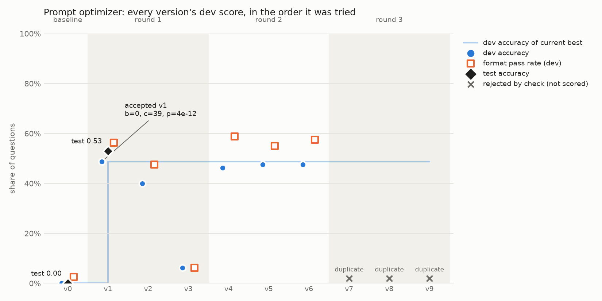

# Week 6 — Advanced Prompting: Chaining, Self-Consistency, ReAct, Prompt Optimizer

**Model setup:** every experiment this week ran locally through Ollama on an RTX 2080 Ti. The task model is `llama3.2:3b` (`num_ctx=8192`, one request at a time). The optimizer's proposer model is `qwen2.5:7b`. I chose a small local model on purpose: Claude scored too well in Week 5 to leave failures worth debugging, and a 3B model leaves real errors to study.

---

## What I Built

| # | Deliverable | Module | Tests |
|---|---|---|---|
| 1 | Prompt chaining framework with branching and per-step error handling | `prompting/chain.py` | `tests/test_chain.py` ✅ |
| 2 | Self-consistency with confidence scores | `prompting/consistency.py` | `tests/test_consistency.py` ✅ |
| 3 | ReAct loop with 3 action types (`search`, `lookup`, `calculate`) | `prompting/react.py`, `demos/hotpot_tools.py` | `tests/test_react.py` ✅ |
| 4 | Prompt optimizer with version tracking | `prompting/optimizer.py` | `tests/test_optimizer.py` ✅ (54 tests) |

Shared layers: `prompting/parsing.py` (tag extraction, number/label/text parsers, answer normalization, EM/F1, ReAct parser; `tests/test_parsing.py` ✅) and `prompting/llm.py` (an Ollama client that returns an `LLMResponse`, plus a `FakeLLM` that every test suite uses so no test ever calls a real model).

---

## Architecture

### Shared response contract
Every model call goes through `llm.complete(system, messages, temperature, max_tokens, stop, seed)` and returns an `LLMResponse(text, stop_reason, input_tokens, output_tokens, latency_s)`. Every parser returns a `ParseResults(ok, value, error)`. Because each module depends only on these two shapes, any of them can be tested with `FakeLLM` and pointed at a different model without code changes.

### 1. Chaining
```
initial_state ─▶ Step A ─▶ Step B ─▶ ... ─▶ ChainResult(status, output, state, trace)
                   │
     build_prompt(state) → llm → parser ──ok──▶ state[output_key] = value → next(state) picks the next step
                                   │
                                   └─fail──▶ repair turn (parser error sent back) × max_repairs ──▶ status "failed"
```
- Each `Step` owns its prompt builder, parser, output key, temperature, token budget and repair budget.
- `next` can be a fixed step name or a callable, which is what makes branching possible. A step can also be a plain Python function (`fn`) instead of a model call.
- `max_steps` caps the chain, so a branching cycle can't run forever.

### 2. Self-consistency
```
same prompt × N samples (temperature 0.7, seeds base_seed+i)
   → parse each → drop truncated or unparsable samples → vote on normalized numbers
   → SCResults: answer, status (ok | tie | insufficient_samples),
                vote_share_valid, vote_share_all, margin, normalized entropy, distribution
```
- Early stopping is optional: once the leader can't be caught by the samples that remain, stop drawing.
- `min_valid` returns `insufficient_samples` instead of a confident answer built on too few votes.

### 3. ReAct
```
question ─▶ [thought → <action>tool</action><input>arg</input>] ─stop at "<observation>"─▶ run tool
               ▲                                                                              │
               └──────────────── <observation>result</observation> ◀──────────────────────────┘
           ...until <finish>answer</finish>, or a guard trips → fallback call → answer
```
- **Tools:**
  - `search`: fuzzy title match with `difflib` over the example's paragraphs.
  - `lookup`: finds the next sentence containing a keyword in the current paragraph; it remembers its position between calls.
  - `calculate`: a safe AST arithmetic evaluator. It never uses `eval`.
- **Guards:**
  - Unknown tool → a repair turn that lists the valid tools.
  - Tool exception → the error is shown to the model and the run continues.
  - A repeated `(tool, arg)` pair → a warning the first time, `loop` the second time.
  - `max_format_errors` → `format_failure`.
  - `max_steps` → `max_steps`.
  - Token budget → `context_full`.
- Only the parsed `kept` text goes into the conversation history. Any observation the model hallucinates is cut off before it reaches the history.

### 4. Prompt optimizer
```
baseline ─▶ evaluate on train + dev ─▶ log v0
   │
   └─ each round:
        evaluate current best on train ─▶ build_metaprompt(best, train failures + model outputs)
          ─▶ proposer × k ─▶ parse <diagnosis>/<prompt>
          ─▶ free checks (duplicate hash, required "<answer>", max_words, 8-gram leakage vs dev+test)
          ─▶ score survivors on train + dev (cache keyed by (prompt_hash, example_id))
          ─▶ round winner = best dev accuracy
          ─▶ paired sign test vs current best on dev: accept iff c > b and p ≤ alpha
          ─▶ one JSONL log line per version (accepted | rejected_test | rejected_check)
   stop on `rounds` or `patience` → score baseline and final prompt on the untouched test set
```
- **Why splits:** train feeds the metaprompt; dev decides which candidate is accepted; test is used only once, after the run. That keeps the final number free of selection bias, which the winner's curse would otherwise add.
- **Why free checks before scoring:** a rejected candidate costs zero model calls.
- **Why a paired sign test:** both prompts answer the same questions, so the only evidence is where they *disagree* (b = best right and candidate wrong, c = candidate right and best wrong). Questions both get right, or both get wrong, carry no information.

---

## Code

```
prompting/
  llm.py            OllamaClient + FakeLLM + LLMResponse
  parsing.py        extract_tag, parser factories, normalize/EM/F1, parse_react
  templates.py      Jinja2 render(name, **vars)
  chain.py          Step, run_chain, ChainResult
  consistency.py    self_consistency, SCResults
  react.py          run_react, ReActResults, ReActStep
  optimizer.py      evaluate, propose, check_candidate, build_ngram,
                    sign_test, paired_counts, optimizer, log_version
templates/          system/ and user/ Jinja templates (incl. optimizer.j2 pair)
demos/
  load_data.py      HotpotQA + GSM8K loaders
  hotpot_tools.py   search / lookup / calculate for ReAct
  optimizer.py      optimizer run on GSM8K (train 20 / dev 80 / test 200)
  plot_optimizer.py version-vs-score chart → artifacts/optimizer_versions.png
tests/              test_parsing, test_chain, test_consistency, test_react, test_optimizer
results/            optimizer.jsonl, optimizer_test.json
artifacts/          optimizer_versions.png
```

---

## Demo

### Chaining and ReAct on HotpotQA (50 questions; scored as correct if the gold answer appears in the output)

| Approach | Accuracy | Notes |
|---|---|---|
| Single-call baseline | **62%** | |
| Chain | 46% | Paired vs baseline: b = 12, c = 4, p = 0.077 |
| ReAct | 42% | Finished on its own in 34/50 runs; 56% correct on those (19/34). The fallback rescued 2 of the 16 that didn't finish |

Both scaffolds **lost** to a single call on a 3B model. The chain's loss isn't significant at 0.05 (p = 0.077), but it points the same way as ReAct's.

### Self-consistency on GSM8K

| Setup | Accuracy |
|---|---|
| Greedy baseline | 88% |
| N = 1 (temperature 0.7) | 86% |
| N = 3 | 91% |
| N = 5 | **95%** (p = 0.065 vs baseline) |

The confidence scores behaved as they should. Answers with a high vote share were right more often than answers with a low vote share, so vote share can be used to decide which answers to trust and which to send for review.

### Prompt optimizer on GSM8K (train 20 / dev 80 / test 200, 4 rounds max, k = 3, patience 2, alpha 0.1)

| | Test accuracy | Format pass rate | Notes |
|---|---|---|---|
| Baseline (v0) | **0%** (0/200) | 2.5% on dev | The prompt showed `<answer>YOUR ANSWER</answer>` |
| Final (v1) | **53%** (106/200) | 67% | 79% of parsed answers were correct |

- **Final paired sign test on test:** b = 0, c = 106, p ≈ 2.5 × 10⁻³².
- **Run summary:** 10 versions logged. 1 accepted (v1, dev b = 0, c = 39, p ≈ 4 × 10⁻¹²), 5 rejected by the sign test or as non-winners, and 3 rejected as duplicates. Stopped on **patience** in round 3.
- **Final prompt:** *"Solve the problem step by step, showing your calculations. Check each calculation carefully. End your response with the final number in answer tags, for example <answer>42</answer>."*

---

## Visualizations



### What the chart shows
- Every prompt version is shown in the order it was tried, grouped by round.
- **Blue dots:** each version's dev accuracy.
- **Pale step line:** the dev accuracy of the current best version. It only moves up when a candidate is accepted.
- **Orange squares:** format pass rate, the share of answers the parser could read. The gap between a square and its dot is questions that parsed but had the wrong number.
- **Black diamonds:** accuracy on the untouched test set.
- **Grey ✕ marks:** candidates rejected by the free checks; they were never scored.

### When to reach for it
Any time you're iterating on a prompt (by hand or automatically) and need to answer three questions:
1. Did a change actually help, or was it noise?
2. Is the gain holding up on data that wasn't used to choose the prompt?
3. Is the failure about *reasoning* or about *format*?

The format/accuracy split is what makes it more useful than a plain accuracy-over-time line.

### Pattern table

| Pattern | What it looks like | What it means |
|---|---|---|
| Steady climb | Step line rises across several rounds, with test close to dev | The search is finding real, general improvements |
| **One jump, then flat** | One big accepted step, then nothing passes the test | The first change fixed something obviously broken; what's left is small gains the dev set is too small to confirm |
| Dev rises, test lags | Accepted versions sit well above their test diamonds | Overfitting to dev, or the winner's curse from picking the best of k |
| **Format ceiling** | Orange squares stuck at one level while candidates change other things | The search is aimed away from the main failure; the metaprompt isn't showing that format is the problem |
| **Duplicate collapse** | A round made entirely of ✕ duplicates | The proposer is repeating itself (same input and same seeds), so the round is wasted |
| Noise cloud | Candidates scattered above and below the best, none accepted | Changes are cosmetic; real effects are smaller than what the sample can detect |

**My run matches three rows:**
- **One jump, then flat:** v1 went from 0% to 49% on dev, then nothing passed.
- **Format ceiling:** format pass rate stayed at about 55–59% for every round-2 candidate.
- **Duplicate collapse:** all of round 3 was duplicates.

### Business explanation
The original instructions told the model to write its answer as "YOUR ANSWER", and the model copied those words literally. So almost no answer was in a form our system could read, and accuracy was 0%. The automated tuner found and fixed that, taking accuracy on unseen questions from 0% to 53%. That improvement is statistically certain.

When the model's answer *can* be read, it is right about 80% of the time. The remaining loss is mostly answers in the wrong format (a third of responses), not wrong math. So the next investment should go into making the output format reliable, not into improving the reasoning.

### Red Flag Checklist
- [ ] **Dev far above test** → overfitting or the winner's curse; trust the test number.
- [x] **Format pass rate flat while accuracy moves** → the search isn't aimed at the main failure. *(present: about 55% ceiling)*
- [x] **The accepted prompt closely matches the example in the metaprompt** → the proposer copied the example instead of searching. *(present: v1 is nearly the template's example)*
- [x] **A round of only duplicates** → fixed seeds plus an unchanged metaprompt; the round produced nothing. *(present: round 3)*
- [x] **Train score far from dev** → with 20 train questions, train swings about ±0.1 by chance, so don't read it. *(present: v1 train 0.85 vs dev 0.49)*
- [ ] **Accepted with p barely under alpha** → over many rounds, some lucky accepts are expected; check against test.
- [ ] **Truncation rising** → longer prompts or answers are hitting `max_tokens`. *(absent: 1%)*

---

## When to Use Each Pattern

| Pattern | Use it when | Avoid it when | Cost per question | My evidence |
|---|---|---|---|---|
| **Single call** | The model can do the task in one pass | It can't | 1 call | HotpotQA 62%: beat both scaffolds on a 3B model |
| **Chaining** | Each step is clearly *easier* than the whole task, steps can be checked on their own, or you need branching, different settings, or code between steps | Information has to be split across steps, or the model is weak at following formats | k calls plus repairs | 46% vs 62%: errors compound and each step loses context |
| **Self-consistency** | Answers can be voted on (numbers, labels), you want a confidence score, and you can afford N× the calls | Free-text answers that can't be compared, or cost is tight | N calls | 88% → 95% at N = 5; vote share tracked accuracy |
| **ReAct** | The answer needs information the model doesn't have, so it has to search, look things up, or calculate | Everything needed is already in context; the format overhead costs a small model too much | Variable (steps × calls) | 42% overall, 56% on runs that finished; format and loop failures dominated |
| **Tree of thought** (not built) | Problems where you must explore and score several partial paths and backtrack (puzzles, planning) | Linear problems; the cost multiplies at every branch | Branches × depth | No evidence from my runs; mentioned for completeness |
| **Prompt optimizer** | You have a labeled eval set, the task is stable, and you can afford to search | No eval set, or the main failure isn't something wording can fix | (k × (train+dev)) per round, then test once | 0% → 53% by fixing format; it can only search where the metaprompt points it |

**Rule of thumb from this week:** scaffolding helps only when each piece is easier than the whole and the model can reliably follow the scaffold's format. On a 3B model, format compliance was the binding constraint in every pattern.

---

## What I Learned

1. **The placeholder trap is real and measurable.** Showing `<answer>YOUR ANSWER</answer>` gave 2.5–6% format pass. Showing `<answer>42</answer>` gave 47–59%. I hit the same bug in the ReAct fallback earlier this week, where the model copied "ANSWER" literally. Small models copy examples word for word, so examples must be concrete.
2. **The metaprompt's example anchors the search.** The accepted prompt is almost word for word the example in my metaprompt, and every diagnosis paraphrases the example diagnosis. The optimizer can only explore where the metaprompt points. Mine pointed at arithmetic, while the real failure was format.
3. **Fixed seeds plus an unchanged input give duplicate rounds.** When no candidate is accepted, the next round's metaprompt is identical. With the same seeds, the proposer returns the same replies, so the round is wasted and patience runs out. Seeds should change each round (for example `base_seed = round * k`). Seeded runs are reproducible; to learn how often something happens, vary the seed.
4. **Scaffolding costs a small model.** Chaining and ReAct both lost to a single call on HotpotQA. Errors compound across steps, and every extra format rule is another chance to fail.
5. **Paired tests over raw accuracy.** Comparing prompts on the same questions and counting only the disagreements (b, c) gives a real p-value from 50–200 questions. A raw accuracy difference at that size is mostly noise.
6. **Split roles keep the final number honest.** Train builds the metaprompt, dev selects, test is used once. Selecting the best of k on dev inflates dev scores, which is why the test score is the one I report.

---

## Questions

1. Would labeling each failure in the metaprompt as "no answer tags" vs "wrong number" redirect the proposer toward format and break the 55% ceiling?
2. With per-round seeds, would rounds 2–3 have found a format-compliant prompt, or is 80 dev questions too few to confirm smaller gains?
3. Is a lenient parser (accepting a missing closing tag) the right production choice, or does it hide a format problem that should be fixed in the prompt?
4. Would a stronger proposer (or a hosted model) produce more diverse candidates, or would it be anchored by the example just as much?
