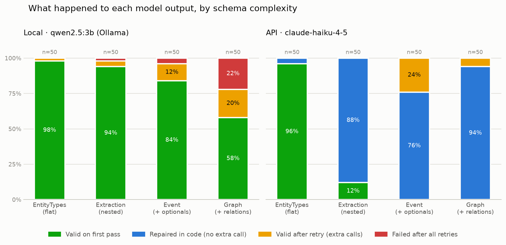

# Week 7 — Structured Outputs: Submission

---

## Models and setup

| | Local tier | API tier |
|---|---|---|
| Model | `qwen2.5:3b` via Ollama | `claude-haiku-4-5-20251001` |
| Quantization | Q4_K_M | n/a (hosted) |
| Context length used | `num_ctx = 8192` (set explicitly in `OllamaClient`) | model default |
| Temperature | 0 for all reliability runs, 0.7 for confidence sampling | same |
| Max output tokens | 1024, raised ×1.5 on truncation, capped at 2048 | same |
| Hardware | NVIDIA RTX 2080 Ti (11 GB) | Anthropic API |

**How the local model was chosen.** The brief asks for a model whose first-pass schema-valid rate on the most complex schema lands in 40–70%. I calibrated on 50 CoNLL04 validation sentences with the `Graph` schema, prompt-only, `max_retries=0`:

| Model | First-pass valid on `Graph` |
|---|---|
| llama3.2:3b | 16/50 = 32% (below the band) |
| **qwen2.5:3b** | **25/50 = 50%** (middle of the band) |

At n=50 the margin on a ~50% rate is about ±14 points, so qwen's true rate is plausibly 36–64% (in the band) while llama's is plausibly 19–45% (mostly below it). The calibration sentences (`load_conll04(n=100)[:50]`) were kept separate from the evaluation sentences (`[50:100]`).

**Claude is a ceiling reference with a caveat:** Haiku is Anthropic's cheapest tier, not its strongest. Every local-vs-API gap reported here is therefore a *lower bound* on what an API model can do.

**Datasets (all real, unmodified except where stated):**
- **CoNLL-2003** (`lhoestq/conll2003`, validation split): Reuters news sentences with PER/ORG/LOC/MISC labels. Used for `EntityTypes`, `Extraction`, `Event`. The original `conll2003` loader no longer works because `datasets` dropped loading scripts.
- **CoNLL04** (`DFKI-SLT/conll04`): news sentences with entities (Peop/Org/Loc/Other) and five relation types. Used for `Graph`. Every CoNLL04 sentence has at least one relation, so the "no relations" case is never tested — a known limitation.
- **AG News** (`fancyzhx/ag_news`, test split, 100 articles, seed 0): used for the field-order experiment (Deliverable 5). Cleaned of dataset artifacts before use (see D5).

---

## What I Built

```
week07/
  llm.py                        OllamaClient, AnthropicClient (+ complete_with_tools), FakeLLM
  data/loaders.py               CoNLL-2003, CoNLL04, AG News loaders → plain dicts with gold tuples
  extraction/
    schemas.py                  all Pydantic schemas + value repair rules + recursive walker
    repair.py                   text repair rules, parse stage, run_pipeline, describe_loc
    docs_gen.py                 schema → human-readable markdown docs
    prompts.py                  one held-out example per schema + build_prompt
    extractor.py                extract(): the retry loop
    evaluation.py               P/R/F1, outcome counts, rule hits, flat accuracy, D5 scoring
    grounding.py                ungrounded(), grounded_rate()
    confidence.py               sample(), agreement(), majority(), calibration_table()
  function_calling/
    tools.py                    3 tools on the CoNLL corpus + TOOL_MAPPING registry
    formatter.py                Claude tool format, parse tool_use, run tools → tool_result
    loop.py                     run_tool_loop(), extract_with_tool()
  experiments/                  calibrate, run_chart, evaluate, confidence, D4, field_order, plot_outcomes
  tests/                        test_repair, test_extractor, test_evaluation, test_confidence,
                                test_function_calling, test_loop, test_field_order
  docs/schemas.md               generated schema documentation (Deliverable 1)
  results/                      every run file cited below — committed
  artifacts/                    validation_outcomes.png, pytest output
```

**Test suite:** all tests passing (`python -m pytest`). Every model-facing test uses `FakeLLM` / a fake tool client with scripted responses, so the suite spends no tokens and runs in seconds.

---

## Architecture

```
text + schema ─▶ build_prompt (task + generated field docs + held-out example + text)
                     │
                     ▼
              llm.complete() ──▶ run_pipeline(raw_text, schema, stop_reason)
                     ▲                │
                     │      ┌─────────┴──────────────────────────────────────────┐
                     │      │ 1. truncated? (stop_reason length/max_tokens) → stop│
                     │      │ 2. json.loads raw text — valid JSON is never touched│
                     │      │ 3. TEXT RULES: strip_fences → extract_json_span →   │
                     │      │    trailing_comma_removal → json.loads              │
                     │      │    → fallback: ast.literal_eval (python_literal)    │
                     │      │ 4. VALUE RULES (recursive walk over schema fields): │
                     │      │    nullify (None-able fields only) → normalize_enum │
                     │      │    (case only) → wrap_list_field                    │
                     │      │ 5. schema.model_validate — the ONLY validation      │
                     │      └─────────┬──────────────────────────────────────────┘
                     │                │
           ok? ──────┴── no ──▶ truncated → raise max_tokens, resend same messages
            │                   otherwise → append [assistant: failed output,
           yes                               user: plain-language error] and retry
            ▼                   after max_retries → outcome "failed" (never raises)
   ExtractionResult(value, outcome ∈ {first_pass, repaired, retry, failed},
                    attempts, raw_outputs, tokens)
```

**Key decisions:**

- **Repair runs before retry, always.** Repair is deterministic and free; a retry is a full model call that also resends the prompt and the failed output. On Claude, `strip_fences` alone turned 146 of 200 outputs from "would need a retry" into "fixed for free".
- **Two stages, kept separate.** Text rules fix Layer 1 (can it be parsed?); value rules fix Layer 2 (is it the right shape?). Splitting them lets the outcome bands and the hit counts say which layer failed.
- **`json.loads` on the raw text first.** Rules only run if the raw text fails to parse, so a rule can never damage output that was already valid (e.g. `trailing_comma_removal` would otherwise alter a valid string containing `",}"`).
- **Rule order: `strip_fences` before `extract_json_span`.** The span rule would also remove fences; run first, it would take the credit and `strip_fences` would show zero hits even though fences are the most common failure.
- **One recursive walker owns all schema knowledge.** The value rules each take a single value; `walk()` loops over the *schema's* fields (never the data's keys), strips `Optional`, decides which rules apply, and recurses into nested models. One function handles `Extraction`, `Event` and `Graph`.
- **Repair may change how a value is written, never invent one.** `"org" → "ORG"` is a repair; `"organization" → "ORG"` is a judgment about meaning and is left for retry. Truncated output is never "closed" with brackets — it is detected from the model's own stop reason and retried with more tokens.
- **The schema stays pure.** No `field_validator(mode="before")` repairs inside the models: they would run silently inside `model_validate`, every repaired output would look like a first-pass success, and the hit counts would disappear.

---

## Deliverable 1 — Structured extraction library

**Schemas** (`extraction/schemas.py`), ordered as the complexity ladder used in the chart:

| Rung | Schema | Adds |
|---|---|---|
| 1. Flat | `EntityTypes` | four required booleans |
| 2. Nested | `Extraction` | `list[Entity]` |
| 3. Nested + optionals | `Event` (+ `Location`) | `str \| None` fields and an optional sub-object |
| 4. Relationships | `Graph` (`RelEntity`, `Relation`) | cross-field references, checked by a `model_validator` |

Every model uses `extra="forbid"` and every field has a description. Generated documentation for all schemas, including the D4 tool inputs and the D5 schemas, is in **`docs/schemas.md`** (`python -m extraction.docs_gen`). The generator follows nested models with a to-do list plus a `done` set, so a model used twice is documented once. The same generated docs are inserted into every prompt, so the documentation and the model's instructions cannot drift apart.

**What goes back to the model on a retry.** I send the original prompt, then the model's failed output as an `assistant` turn, then a rewritten error as a `user` turn (Lesson 7's option C + B):

```
Your JSON did not match the required format. Fix these problems:
- "entities" -> item 3 -> "confidence": Extra inputs are not permitted (you wrote 0.9)
Return the corrected JSON only. Do not add any explanation.
```

The message is built from `ValidationError.errors()`: the location is rewritten 1-indexed in words (`describe_loc`), the input is shown with `repr` and cut to 80 characters, URLs and error-type codes are dropped, and only problems that remain *after* repair are listed (the model is never asked to fix what code already fixed).

*Does the Week 6 reasoning still hold?* In Week 6 the raw `ParseResults.error` fed the repair turn. It still holds in structure — the model sees its own output plus the exact problem — but a Pydantic field path is a programmer's format: `entities.2.type` counts from zero, and a 3B model can easily "fix" the second entity instead of the third. So I kept the idea (send the specific error) and changed the wording (1-indexed, plain language). I did not run an A/B test of raw vs rewritten errors; that is listed under Questions.

**Two audiences, two strings.** The model gets the message above. The log gets a different line, built in `extract()` because only it knows the item and attempt:

```
[conll04_validation_0042] schema=Graph attempt=1/3 FAILED validation | rules fired: ['strip_fences']
```

The log answers questions the model never needs (which item, which attempt, whether repair already ran); the model message answers the only question the model needs (what to change).

**Retry settings.** `max_retries=2` (up to 3 calls). Of qwen's 21 `Graph` items that failed on attempt 1, 10 were rescued by a retry and 11 never were.

---

## Deliverable 2 — Entity extractor

**Entities and relationships** use `Graph` on CoNLL04. Relations refer to entities **by text, not by ID**: a wrong name fails loudly (the `model_validator` rejects a relation whose subject or object is not in the entities list), while a wrong-but-valid ID would point at the wrong entity silently.

**Main run accuracy (temperature 0, 50 sentences per schema):**

| Schema | Metric | qwen (valid only / end-to-end) | Claude (valid only / end-to-end) |
|---|---|---|---|
| `EntityTypes` | per-field accuracy: person / org / loc / misc | 0.78 / 0.42 / 0.72 / 0.72 | 0.98 / 0.96 / 0.86 / 0.72 |
| `Extraction` | entity F1 | 0.62 / 0.62 | 0.83 / 0.83 |
| `Graph` | entity F1 | 0.57 / 0.50 | 0.74 / 0.74 |
| `Graph` | relation F1 | 0.11 / 0.10 | 0.42 / 0.42 |
| `Event` | — | no gold labels: schema-validity only | |

**Grounded rate** (share of extracted entity texts that appear in the sentence): qwen 1.00 (`Extraction`) / 0.94 (`Graph`); Claude 0.98 / 0.99. Grounding catches invented and reworded names; it cannot catch partial spans (`"Blackburn"` is a substring of the sentence), which only gold labels reveal.

Two notes on these numbers: end-to-end F1 counts a failed extraction as "found nothing", which is why qwen's `Graph` entity F1 drops 7 points from valid-only to end-to-end — its 22% failure rate costs accuracy on top of its accuracy problem. And `has_misc` is 0.72 for *both* models: MISC is the "everything else" category, and both models struggle with it equally.

### Confidence scores

**Definition.** *Confidence = the fraction of 5 samples (temperature 0.7, seeds 42–46) that produced this exact `(text, type)` pair — or `(subject, relation, object)` triple — with failed samples counted as not producing it.* The final prediction is the majority vote (confidence ≥ 0.5). I chose agreement over self-reported confidence because a self-reported number is text the model writes, not a measurement.

**Calibration — entities:**

| Confidence | qwen n | qwen correct | Claude n | Claude correct |
|---|---|---|---|---|
| 0.2 | 106 | 13% | 8 | 38% |
| 0.4 | 69 | 28% | 9 | 56% |
| 0.6 | 53 | 49% | 10 | 20% |
| 0.8 | 36 | 69% | 8 | 63% |
| 1.0 | 44 | 82% | 164 | 81% |

**Calibration — relations:**

| Confidence | qwen n | qwen correct | Claude n | Claude correct |
|---|---|---|---|---|
| 0.2 | 167 | 4% | 18 | 22% |
| 0.4 | 32 | 6% | 10 | 60% |
| 0.6 | 17 | 6% | 6 | 17% |
| 0.8 | 12 | 33% | 9 | 44% |
| 1.0 | 10 | 20% | 27 | 52% |

Rows under ~20 items are noise (±25–30 points) and I draw no conclusion from them.

**What the tables show:**

1. **For qwen, entity confidence works as a ranking.** Accuracy rises at every step (13% → 82%) and every row has 36+ items. It runs about 10 points high at every level ("0.8" means ~70% correct), so it is useful for ranking and routing, not as a literal probability. A usable routing rule: auto-accept 1.0, human-review 0.6–0.8, drop ≤ 0.4.
2. **For Claude, the score cannot separate right from wrong.** 82% of its entities (164/199) scored 1.0, and 19% of those are wrong. Claude gives the same answer across samples even when the answer is wrong.
3. **The general finding: agreement measures consistency, not correctness.** It catches *random* errors (a model unsure of itself changes its answer) and is blind to *systematic* errors (the same wrong answer five times). It worked for the small model, whose mistakes are mostly random, and failed for the large one, whose mistakes are mostly consistent. For relations, even qwen's 1.0 items were right only 2 times in 10.

**Did voting improve accuracy?**

| | single run, temp 0 | majority of 5, temp 0.7 |
|---|---|---|
| qwen entity / relation F1 | 0.50 / 0.10 | 0.53 / 0.13 |
| Claude entity / relation F1 | 0.74 / 0.42 | 0.74 / 0.34 |

About +3 points for qwen and nothing (relations possibly worse) for Claude, for 5× the model calls — within noise at n=50. Voting's value here is the confidence score, and only for the local model; it does not buy accuracy.

---

## Deliverable 3 — Validation and repair pipeline

Seven rules, each returning `(value, changed)` and each tested three ways: it fires on broken input, stays silent on clean input, and does not damage real content.

| Rule | Stage | Fixes |
|---|---|---|
| `strip_fences` | text | `` ```json … ``` `` around the JSON |
| `extract_json_span` | text | prose before/after the JSON |
| `trailing_comma_removal` | text | `[1, 2,]` |
| `python_literal` | parse fallback | single quotes, `True`/`None` (via `ast.literal_eval`, never `eval`) |
| `wrap_list_field` | value | a single object (or bare list) where a list was expected |
| `normalize_enum` | value | capitalization on `Literal` fields only |
| `nullify` | value | `""`, `"N/A"`, `"unknown"` … → `None`, only on fields that allow `None` |

A stringified number (`"3"` for an `int`) has no rule: Pydantic already converts it, so a rule there would be redundant.

**Hit counts — main run (rule counted at most once per item, across all attempts):**

| Rule | qwen (200 items) | Claude (200 items) |
|---|---|---|
| `strip_fences` | 2 | **146** |
| `extract_json_span` | 2 | 0 |
| `trailing_comma_removal` | 0 | 0 |
| `python_literal` | 0 | 0 |
| `wrap_list_field` | 0 | 0 |
| `normalize_enum` | 0 | 0 |
| `nullify` | 0 | 0 |

**Dead rules in this run:** `trailing_comma_removal`, `python_literal`, `wrap_list_field`, `normalize_enum`, `nullify` — five of seven never fired on 400 outputs. They are not dead code in general: the malformed-output corpus (32 cases in `test_repair.py`) proves each one works, and the Claude structured-output docs confirm enum capitalization drift is a documented behavior. But for *these* two models on *these* prompts, the whole repair layer's measurable value came from one rule. `strip_fences` is the rule that earns its place: it accounts for nearly all of Claude's "repaired" band.

**A real-data finding (D5).** AG News stores dollar signs as `\$`. When a model copied a quote containing `\$10 million` into JSON, `\$` is an invalid JSON escape, `json.loads` failed, and `python_literal` sometimes rescued it — so in that run `python_literal`'s hits came from a backslash problem, not the single-quote problem it was written for. The fix was cleaning the input, not adding a rule (see D5).

**Human-readable errors:** see D1 — one string for the model (what to change), a different line for the log (which item, which attempt, which rules already fired).

---

## Deliverable 4 — Function calling formatter

**Tools** (`function_calling/tools.py`), all working on the real CoNLL-2003 corpus: `search_sentences(keyword, limit)`, `get_sentence(sentence_id)`, and `record_entities(Extraction)`. Each has a Pydantic input model (which becomes the tool's `input_schema` and also validates Claude's input), a description saying what it does / when to use it / what it returns, and an entry in `TOOL_MAPPING`.

**Formatter** (`formatter.py`): `to_claude_tool` → `{name, description, input_schema}`; `parse_tool_calls` keeps the `tool_use` blocks; `run_tool_call` never raises — an unknown tool, invalid input (1-indexed field errors, as in D1) or a tool exception each become a `tool_result` with `is_error: True`; `run_tool_calls` answers every block, in order, in one user message.

**Loop** (`loop.py`): `run_tool_loop` calls Claude → runs the tools → appends the assistant turn and then one user turn of `tool_result`s → repeats. `steps` counts completed tool rounds; with `max_steps=3` the tools run exactly 3 times (the Week 6 off-by-one, now tested). `tool_choice` applies to the first call only, so a forced tool can never stop Claude from giving a final answer.

**Live demo:** `run_tool_loop` was run against Claude on real questions over the corpus, with Claude choosing which tools to call (`tool_choice` left unset).

**Native tool use as a structured-output method.** `extract_with_tool` forces a call to `record_entities`; the validated *input* is the extraction, and a failed validation goes back as an `is_error` tool_result (the native retry channel). Same 50 CoNLL-2003 sentences and the same instructions as the D1 `Extraction` run on Claude:

| | D1: prompt + repair | Native tool use |
|---|---|---|
| valid with no repair or retry | 12% | **100%** (50/50) |
| needed repair | 88% (all fences) | n/a — no text to repair |
| needed a retry / failed | 0% / 0% | 0% / 0% |
| entity precision / recall / F1 | 0.87 / 0.79 / 0.83 | 0.88 / 0.89 / **0.89** |

**What the native path buys:** the parsing layer disappears (input arrives as a dict, so Claude's fence habit no longer exists), 100% first-try validity, and possibly better recall (+10 points; the F1 gain of ~6 points is at the edge of the ±6-point noise margin for ~133 gold entities, so I report it as "slightly higher, possibly real").

**What it costs:** input tokens. The native path averaged 1,094 input and 79 output tokens per extraction, because the tool definition and Anthropic's tool-use instructions are sent on every request — a fixed cost that scales linearly with volume. It is **Claude-specific**: the local tier cannot use it, so the local model still needs the entire D3 pipeline. And with no raw text, the hit counts that revealed Claude's habits no longer exist — the native path is more reliable and less observable.

---

## Deliverable 5 — Field-order experiment (added requirement)

**Question:** does writing the evidence *before* the label make the label more accurate than writing the label first?

**Design.** Two schemas identical except for field order — `EvidenceFirst(evidence, topic)` and `LabelFirst(topic, evidence)`, both fields required — on the same 100 AG News articles at temperature 0, in six arms: qwen prompt-only (×2), Claude prompt-only (×2), qwen constrained with Ollama `format=<schema>` (×2). The prompts differed only in field order (docs table and example). Order compliance was measured on the **raw** text, because Pydantic always returns fields in schema order and would make every output look compliant.

**Data cleaning.** AG News text contains `\$` for `$` and stray backslashes as line breaks. Models copying these into a JSON string produced invalid escapes and parse failures on a two-field schema. Before running, `\$` → `$` and remaining `\` → space, applied once in the loader so every arm saw the same text and grounding used the same cleaned text.

**Paired disagreements** (articles where exactly one arm was right):

| Pair | Evidence-first right only | Label-first right only | Chance of a split this lopsided if order made no difference |
|---|---|---|---|
| qwen prompt-only | 3 | 7 | ~34% |
| Claude prompt-only | 1 | 2 | ~100% |
| qwen constrained | 5 | 7 | ~77% |

(Exact two-sided sign test: under "order doesn't matter", each disagreement is a coin flip.)

**Conclusion: no detectable effect of field order.** Field order changed the answer on only ~10 of 100 articles for qwen and 3 for Claude. All three pairs lean slightly toward label-first — the opposite of the hypothesis — but none is distinguishable from chance. The constrained pair is the cleanest test (compliance is guaranteed) and also shows nothing. The most likely reason is the task: an AG News topic is usually obvious from the headline, so there is little reasoning for evidence to support. Rule 6 ("evidence before decision") should matter most on harder decisions; this experiment cannot confirm or reject it there. A null result at n=100 is the honest finding.

**Label spelling.** The topic label set is the dataset's `Sci/Tech`; models often wrote `Science/Tech`. I kept the label as-is because following an explicit label list is part of what this week measures, and both arms saw the same prompt. In production I would rename the label to what models write naturally (see the schema guide).

---

## Visualizations



| Tier | Schema | n | First pass | Repaired | Retry | Failed |
|---|---|---|---|---|---|---|
| qwen2.5:3b | EntityTypes | 50 | 98% | 0% | 2% | 0% |
| qwen2.5:3b | Extraction | 50 | 94% | 0% | 4% | 2% |
| qwen2.5:3b | Event | 50 | 84% | 0% | 12% | 4% |
| qwen2.5:3b | Graph | 50 | 58% | 0% | 20% | 22% |
| claude-haiku-4-5 | EntityTypes | 50 | 96% | 4% | 0% | 0% |
| claude-haiku-4-5 | Extraction | 50 | 12% | 88% | 0% | 0% |
| claude-haiku-4-5 | Event | 50 | 0% | 76% | 24% | 0% |
| claude-haiku-4-5 | Graph | 50 | 0% | 94% | 6% | 0% |

### What it shows

For each schema (ordered by complexity: flat → nested → nested with optionals → relationships) and each tier, what it took to get usable output from the model, as shares of 50 items:

- **green** — valid on the first try (no cost)
- **blue** — fixed by deterministic code, no extra model call (no cost)
- **yellow** — fixed by asking the model again (extra calls)
- **red** — never fixed after 3 attempts (item lost)

Data: `results/extraction_summary.json`, derived from `results/run_qwen2-5_3b.json` and `results/run_claude-haiku-4-5-20251001.json`. Prompt-only on both tiers with identical prompts, temperature 0, `max_retries=2`. Network retries (rate limits, overloads) are excluded from the bands — they measure the service, not the model's output. This chart shows format only (Layers 1–2); accuracy is reported separately in D2.

### When to reach for it

When deciding whether a model can produce output your code can use, how much each schema costs to get there, and where in the complexity ladder a model stops being reliable — in particular the question "can a local model replace the API for this extraction?".

### What to look for — pattern table

| Pattern | What it means | What to do | My run |
|---|---|---|---|
| **Repair band wide, retry band thin** | the model's problems are cosmetic and deterministic | keep the repair rule; optionally fix the prompt and check whether the band shrinks | **Yes — Claude** `Extraction` (88% repaired / 0% retry) and `Graph` (94% / 6%). All of it is `strip_fences` (146 hits). |
| **Failure appears only past a complexity threshold** | the model handles the format up to a certain structure and breaks beyond it | simplify that schema, split it into two calls (entities, then relations), or use a bigger model for that schema only | **Yes — qwen**: failed 0% / 2% / 4% / **22%** across the ladder. 22% ± 12 at n=50; even the low end is double `Event`'s rate. |
| **Tier gap closes after repair and retry** | the small model can reach the same usable rate, at a cost | budget the extra calls; the local option is viable for this schema | **Yes, rungs 1–3**: usable after everything, qwen 100 / 98 / 96 vs Claude 100. |
| **Tier gap does not close** | no amount of repair or retry gets the small model there | this schema needs a different model or a different design | **Yes, rung 4**: qwen 78% vs Claude 100% usable on `Graph`. |
| **Retries help only partly** | some failures are fixable with feedback, others are beyond the model | measure success by attempt number; cap retries where they stop paying | **Partly — qwen `Graph`**: 10 of 21 first-attempt failures rescued, 11 never were. |
| **A retry that "succeeds" by making the data worse** | the schema doesn't fit the text, and the retry forces the model to squeeze the data into it | fix the schema, not the model | **Yes — Claude `Event`** (24% retry). Sentences describing several events got a correct *list* of events first; the schema allows one, so the "fixed" answer merged four teams into `actor: "Essex, Derbyshire, Surrey, and Kent"` — valid, and worse. |
| **Mostly green on the small model, mostly blue on the large one** | colors show *how* output became usable, not which model is better | read green + blue together as "usable at no cost" before comparing tiers | **Yes** — at a glance Claude looks worse; it isn't (100 / 100 / 76 / 94 usable at no cost vs qwen 98 / 94 / 84 / 58). |

### Business explanation

**What it is.** We asked two AI models — a small one that runs on our own hardware and Anthropic's cheapest hosted model — to pull information out of news text in four formats, from a simple checklist up to a map of who-did-what-to-whom. Each bar shows what happened to 50 requests.

**How to read it.** Green and blue mean the answer was usable at no extra cost. Yellow means we had to ask the model again. Red means the answer was lost.

**The finding.** On the three simpler formats, the in-house model is nearly as dependable as the hosted one: after our automatic fixes and re-asks, it delivers 96–100% usable answers versus 100%. On the most complex format — relationships between people, organizations and places — it loses about 1 answer in 5, and the hosted model loses none. Separately from this chart, the in-house model's answers are less often *correct* at every level: roughly 6 in 10 entities right versus 8 in 10 for the hosted model, and only about 1 in 10 relationships versus 4 in 10 (approximate).

**The risk.** If we move this work in-house today, simple extractions are fine, but relationship data would be missing about 20% of the time and wrong most of the time when present — someone would have to catch that, or the business would be acting on bad data. Spending more in-house computing power on the same model (asking it five times and voting) did not close the accuracy gap.

**The decision.** Run simple formats in-house now if keeping data on our own hardware matters. Keep relationship extraction on the hosted API — or test a larger in-house model on that one task — before moving it. The choice for that task is accuracy versus keeping the data in-house; this chart says the small model cannot deliver both.

### Red Flag Checklist

| Check | Answer for this run |
|---|---|
| Is n stated for every bar? | Yes, 50 each, printed on the chart. |
| Does every bar add up to 100%? | Yes — the plotting script warns if any bar is off by more than 1%. |
| Did both tiers get the same prompt and settings? | Yes — prompt-only, same prompt, temperature 0, `max_retries=2`. |
| Are network retries excluded from the bands? | Yes — they are handled in `llm.py` and never reach the outcome logic. |
| Did a known bug touch the data? | Yes, checked: the `Graph` prompt example used the key `relation` instead of `relations`. Measured impact: 0 of 50 first outputs per tier copied the wrong key, so no rerun was needed. (The counting check was confirmed against a string containing the bad key.) |
| Is there an unexplained anomaly? | Claude's `Event` retry rate (24%, double qwen's) — explained: a schema mismatch with multi-event sentences (see pattern table). |
| Is accuracy reported separately from schema-validity? | Yes — D2. The chart alone would make qwen look nearly as good as Claude on `Extraction`; its F1 is 0.62 vs 0.83. |
| Is the sample large enough for the claims made? | Only for large gaps. n=50 gives about ±12 points at 22%; I only claim the `Graph` cliff and the accuracy gaps, not small differences. |
| Is anything measured on calibration data? | No — the model was chosen on CoNLL04 sentences 0–49 and evaluated on 50–99. |
| Model, quantization and context length stated? | Yes — top of this file. |

---

## Schema design best practices (written guide)

Each rule comes with the failure from this week that taught it.

1. **Only require what the text always contains.** A required field the text can't fill forces the model to invent a value, and constrained decoding makes the invention certain (it removes the option of leaving the field out). `Event.date` is `str | None = None` for this reason.
2. **Give the model a legal way to say "not found".** `None` for single values, `[]` for lists. Without it you get `"N/A"`, `"unknown"` and `""`, which pass validation and pollute the data. My `nullify` rule exists as a backstop; it never fired in the main run because the schema already allowed `null`.
3. **Close every closed set — and forbid unknown keys.** A `Literal` turns a silent wrong value into a loud validation error that runs on every request, not only on labeled test data. `extra="forbid"` does the same for invented fields (it caught the `"confidence"` key the model added in the knowledge-check example).
4. **Name labels the way the model naturally writes them.** AG News's `Sci/Tech` was repeatedly written as `Science/Tech`. A `Literal` makes that loud, but the cause is the name. I measured it strictly this week; in production I would rename the label.
5. **Give closed sets an escape hatch, and watch it.** CoNLL's `MISC` is one. Both models scored only 0.72 on `has_misc` — a vague "everything else" category is hard for every model, so track how often it is used.
6. **Make the schema's shape match the text's shape.** `Event` assumed one event per sentence. Real sentences often describe several; Claude returned a correct list, failed validation, and the retry "fixed" it by merging four teams into one `actor` string. The fix is `events: list[Event]`. A retry cannot repair a schema that doesn't fit the data.
7. **One fact per field; lists are lists.** `"Essex, Derbyshire, Surrey, and Kent"` in a single string can't be counted, compared against gold labels, or used — the same mistake as rule 6 seen from the field level.
8. **Copy from the source; compute in code.** Ask the model to copy text (then check it with grounding); never ask it for counts or character positions. `len(entities)` and `sentence.find(text)` are always right.
9. **Field order is the order of thought — but test it.** Putting evidence before the decision is the standard advice. On AG News topics it made no detectable difference on either model; it should matter more when the decision needs reasoning.
10. **Reference by text for small models, and check references in code.** `Graph` relations name entities by their text, and a `model_validator` rejects a relation pointing at a missing entity. A wrong name fails loudly; a wrong ID would pass silently.
11. **Descriptions and examples are part of the prompt — validate them.** The `Graph` example shipped with the wrong key (`relation`). It happened to cause no damage, but a test that validates every example against its schema now catches this class of bug.
12. **State formats and units.** "YYYY-MM-DD, or null" is an instruction; `date: str` is not.
13. **Never ship a confidence number without its definition and a calibration table.** Agreement-based confidence ranked qwen's entities well and said almost nothing about Claude's, because agreement measures consistency, not correctness.
14. **Clean the input before blaming the schema.** A two-field schema failed to parse because the dataset contained `\$`. The fix belonged in the data loader, not in a repair rule or a retry.

---

## What I Learned

- **Format reliability and accuracy are different problems with different fixes.** Repair and retry took qwen from 58% to 78% usable on `Graph` and to 96–100% on everything else, and changed its accuracy not at all. The engineering closed most of the format gap; only a better model closes the accuracy gap.
- **The cheapest fix was the most valuable.** One three-line regex handled 146 of Claude's 200 outputs. Five of seven repair rules never fired.
- **A retry can "succeed" by making the data worse.** The outcome band can't tell a real recovery from a forced compression; only reading the outputs did.
- **Agreement-based confidence detects uncertainty, not error.** Useful for a small, inconsistent model; blind for a large, consistent one.
- **Native tool use removes the parsing problem on Claude, at the cost of a tool definition sent on every call, and does nothing for the local model.**
- **Real data breaks simple schemas in ways test data never does:** `\$` escapes, `Sci/Tech`, multi-event sentences, and an unfixed `MISC` category.
- **A null result is a result.** The field-order experiment found no effect; reporting it with the paired counts is more useful than overstating a 3-vs-7 split.

## Questions

1. I did not A/B test raw Pydantic errors against the rewritten 1-indexed messages on the 3B model. Is that comparison worth running before Week 8, or is the rewritten version the accepted default?
2. For relation extraction on a local model, is the better next step a larger model, splitting `Graph` into two calls (entities first, then relations), or constrained decoding — and how would you order those experiments by cost?
3. Agreement-based confidence failed on Claude because its errors are consistent. What confidence signal is standard in production for a model that is consistently wrong — a second model as judge, retrieval-based verification, or something else?

