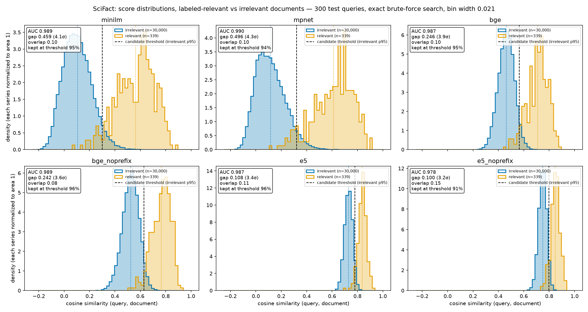
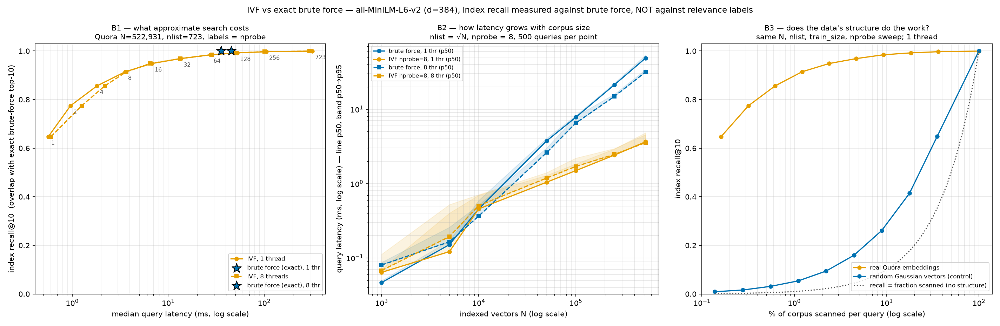

# Week 8 — Vector Search Foundations

## 1. Summary

This week I built the foundations of vector search, the retrieval step behind retrieval-augmented generation. Two main experiments were run. The first compared exact brute-force search against an approximate IVF index across different `nprobe` values, measuring latency and **index recall** — how well IVF reproduces brute force's top-k. It does not measure whether the retrieved passages are relevant; it measures fidelity to exact search, which is the whole goal of approximate nearest-neighbor (ANN) search: match brute force as closely as possible while scanning only a fraction of the vectors. The IVF index and the k-means it depends on were built from scratch. `nprobe` — how many clusters are searched per query — was the swept parameter. The clusters came out imbalanced, as expected on real data, and that imbalance shows up in tail latency. At `nprobe = 8`, IVF reached index recall@10 = 0.91 while scanning 1.2% of the corpus, 12.8× faster than brute force at the median (1 thread), with a p95 latency of 4.68 ms. The point of no return is around `nprobe = 128`: past it, IVF is slower than exact search. My IVF latencies are higher than a production implementation's would be, because the candidate search uses a Python loop over clusters and the corpus is not reordered so each cluster's vectors are contiguous in memory.

The second experiment compared embedding models on retrieval quality against human relevance labels (**retrieval recall**, nDCG@10), using exact search so index error could not contaminate the comparison. Four models in six configurations were tested; BGE with its query instruction ranked first on nDCG@10. The biggest finding was how differently models use the similarity scale, which means similarity thresholds cannot be carried from one model to another: the most common score for an *irrelevant* document is 0.05 for MPNet and 0.74 for E5. That difference says nothing about which model ranks better — E5 scored well above MPNet on nDCG@10 — it shows that the same corpus lands in very different regions of each model's embedding space.

## 2. What I Built

- Deliverable 1 — brute-force vector search (NumPy, exact), single and batched
- Deliverable 2 — IVF with spherical k-means written from scratch
- Deliverable 3 — benchmark suite: index recall vs `nprobe`, latency vs corpus size, random-data control, 1 vs 8 threads
- Deliverable 4 — embedding model comparison on SciFact (4 models, 6 configurations, random-ranking baseline, bootstrap significance tests)
- Written: complexity tradeoffs, HNSW explanation
- Visualizations A and B

## 3. Repository Layout

```
week_08_vector_search_foundations/
  search/
    __init__.py
    brute_force.py        normalize, top_k, top_k_batch, BruteForceIndex
    kmeans.py             assign, kmeans (spherical, stateless)
    ivf.py                IVFIndex
    metrics.py            index_recall + recall/precision/MRR/nDCG@k, evaluate
  data_loading.py         BEIR loaders (string ids)
  embed.py                embed_texts — the only file that imports torch / sentence-transformers
  benchmarks/
    bench_index.py        Deliverable 3, experiments A, B, C
    compare_models.py     Deliverable 4
    significance.py       paired comparisons on per-query nDCG@10
  viz/
    plot_score_dist.py    Visualization A
    plot_benchmarks.py    Visualization B
  tests/
    test_brute_force.py  test_kmeans.py  test_ivf.py  test_metrics.py
  results/                committed — every number in this file traces here
    bench_nprobe_t1.json  bench_nprobe_t8.json
    bench_scaling_t1.json bench_scaling_t8.json
    rand_nprobe_t1.json   rand_nprobe_t8.json
    embed_quora_minilm.json
    compare_models.json   compare_models_per_query.json   compare_model_head_to_head.json
    score_dist_{minilm,mpnet,bge,bge_noprefix,e5,e5_noprefix}.json
    viz_a_summary.json    viz_b_summary.json
  artifacts/              committed
    score_distribution.png   benchmark_curves.png   pytest_all.txt
  data/                   gitignored — BEIR datasets and embedding matrices (Quora alone is ~803 MB)
  requirements.txt
  Submission.md
```

## 4. Setup & Configuration

- **Hardware:** Intel 9th-gen Core CPU (Coffee Lake, Family 6 Model 158 Stepping 12), 16 logical processors, 32 GB RAM; NVIDIA GeForce RTX 2080 Ti (11 GB) for embedding only. All search runs on the CPU in NumPy.
- **Software:** versions pinned in `requirements.txt`.
- **Datasets (BEIR):**
  - **SciFact** — 5,183 abstracts, 300 test queries; some test queries have more than one relevant abstract; relevance is binary.
  - **Quora** — 522,931 questions, 10,000 test queries. Built from duplicate-question data, so it contains many near-duplicates — expect lopsided clusters and exact score ties.
- **Seed:** 0 everywhere (query subsets, corpus subsets, k-means init and training sample, irrelevant-document sampling, bootstrap).
- **Threads:** set through `OMP_NUM_THREADS` / `OPENBLAS_NUM_THREADS` / `MKL_NUM_THREADS` before NumPy is imported (`--threads` flag), and the thread count actually in use is recorded from `threadpool_info()` in every results file. The 1- and 8-thread runs were run one after the other, never concurrently.

## 5. Architecture

### 5.1 Module design

The modules form one pipeline. `embed.py` is the only file that calls an outside model and the only one that imports PyTorch; it takes a list of texts and returns the embedding matrix plus run information (throughput, mean tokens, truncation rate). Keeping PyTorch out of every benchmark keeps its thread pool from contaminating the timings. The embedding matrices are passed to `BruteForceIndex` and `IVFIndex`, which hold them in state. `brute_force.py` also provides three stateless helpers — `normalize`, `top_k` and `top_k_batch` — which both indexes reuse: IVF uses them to pick the best centroids and to rank its candidates. `kmeans` and `assign` are stateless functions; all state lives in `IVFIndex` (centroids, labels, lists). Indexes return **row positions**, not document ids; the caller maps positions to BEIR string ids, so the string-id handling lives in exactly one place and index recall can compare brute force and IVF as plain integer sets.

### 5.2 What changed from Week 2's `most_similar`

In Week 2 I wrote a `most_similar` function that worked much like this week's brute-force top-k: normalized vectors, one matrix-vector product, `argpartition` for the top k. The changes are: (1) search is batched — many queries at once as a chunked matrix-matrix product; (2) the corpus is passages and the query is separate text, not a word looked up from the same vocabulary, so the Week 2 step that excluded the query word from its own results is no longer needed; (3) top-k is split into standalone helpers that the IVF index reuses. The core operation is reused; the code was rewritten to support batching and reuse.

### 5.3 Brute-force design decisions

On construction the corpus is normalized once, so every row is a unit vector and cosine similarity is a single dot product. On unit vectors, ranking by dot product, cosine and Euclidean distance all agree (‖a − b‖² = 2 − 2·cos), though the raw values differ — for distances lower is better, for similarities higher is better. The corpus is stored as contiguous float32.

Top-k uses `argpartition` first, which finds the k best of N scores in O(N) without sorting the rest, then sorts only those k: O(N + k log k) in total, versus O(N log N) for a full `argsort`. The first stage dominates and must be at least O(N), because any score that was not looked at could be the largest.

A single query is memory-bandwidth-bound: every corpus number is read from RAM and used in exactly one multiply-add. For 10,000 passages at 768 dimensions that is 30.72 MB read per query. Batched search amortizes those reads — each corpus number is reused for every query in the batch — which raises arithmetic intensity and throughput. Batches are processed in chunks (default 256 queries) so the score matrix never exceeds `chunk × N` floats; at 10,000 × 768, one 256-query chunk is about 1.97 billion multiply-adds and a 10 MB score matrix. A query whose dimension does not match the index raises `ValueError`, so a model mismatch with a different dimension fails loudly.

### 5.4 IVF design decisions

The IVF index uses **spherical k-means**, so clustering uses the same metric as search (dot product on unit vectors). Each iteration has two steps: **assign** every vector to the centroid with the highest dot product, and **update** each centroid to the mean of its members. Centroids are **renormalized after every update**: the mean of unit vectors is shorter than 1, and tighter clusters have longer means, so without renormalization the tight clusters win dot-product assignments they should not and the clusters grow lopsided — with no error raised. A cluster that ends up empty is re-seeded with a random corpus vector, so a centroid is never zero or NaN.

Because k-means is expensive, it is trained on a random sample (256 × `nlist` vectors), and then the **full** corpus is assigned to the trained centroids in one pass. Assigning only the sample would leave vectors that no search can ever reach. The inverted lists are built in one pass (`argsort` of the labels, `bincount` for the cluster sizes, `split` at the cumulative sizes) rather than one scan per cluster.

At query time `nprobe` is clamped to `nlist`. The candidate ids from the probed lists are global row ids, so the top-k positions within the candidate set are mapped back through it before returning. Batched search scores all queries against the centroids at once, but gathers candidates per query, because each query's candidate set is a different size. Rows with fewer than k candidates are padded with id −1 and score −inf: −1 can never match a real id, so index recall counts the slot as a miss automatically, and −inf sorts last.

### 5.5 Evaluation design

- Deliverable 4 uses **exact brute-force search**, so model comparisons are not contaminated by IVF's boundary misses.
- BEIR ids are loaded and kept as **strings**; the only place positions become ids is a single mapping step through the corpus id list, in embedding order.
- `evaluate` is driven by the **qrels** (the answer key), not the run: every test query is scored, and a qrels query missing from the run raises `ValueError` rather than silently shrinking the average.
- A **random-ranking** row runs through the same evaluation as a pipeline check; any real model near it would indicate a bug, not a weak model.
- For Visualization A, every model scores the **same** random sample of irrelevant documents per query (the generator is re-seeded per model), so differences between panels come from the model, not the sample.
- Per-query nDCG@10 is saved so significance testing can be rerun without re-embedding.

## 6. Deliverable 1 — Brute-Force Search

`BruteForceIndex(vectors)` normalizes and stores the corpus; `search(q, k)` returns `(ids, scores)` for one query and `search_batch(Q, k, chunk_size=256)` returns `(B, k)` arrays. Results are sorted best-first; `k > N` returns all N; zero vectors produce zero scores instead of NaN; a wrong dimension, a 2-D single query or `k < 1` raises `ValueError`. The test suite (52 tests) checks the hand-computed 2-D example from the lesson, agreement with a full-`argsort` oracle, that returned scores equal the recomputed cosines of the returned ids, self-retrieval, batch-equals-single-queries across a partial final chunk, chunk-size independence, clamping and the error cases. One conceptual error surfaced while building: `argsort` on the k candidate scores returns positions **within those k**, not corpus rows — they have to be mapped back through the `argpartition` output.

## 7. Deliverable 2 — IVF

`IVFIndex(vectors, nlist, train_size, max_iter, seed)` trains spherical k-means, assigns the full corpus and builds the lists; `search` and `search_batch` take `nprobe`; `cluster_sizes()` reports the list sizes. The tests check that the lists partition the corpus (every id exactly once), that every stored label is the nearest centroid, that training on a sample still indexes everything, that `nprobe = nlist` reproduces brute force exactly, that index recall never decreases as `nprobe` grows, that results come only from probed clusters, and the −1/−inf padding.

**A contract bug found in my own k-means.** When k-means stopped at `max_iter` without converging, it returned labels computed *before* the final centroid update — so the returned labels did not belong to the returned centroids. The k-means tests passed because their convergence test used easy blob data that always converged early; the IVF test "every label is the nearest centroid" failed on random data, which needed all 25 iterations. The fix had two layers: k-means now returns labels consistent with the centroids it returns, and IVF always re-assigns the full corpus against the final centroids. A new test forces the non-converged path (`max_iter = 2`, with a precondition check that the cap was actually hit).

## 8. Deliverable 3 — Benchmarks

### 8.1 Timing methodology

- **Model and data:** Quora corpus embedded with `all-MiniLM-L6-v2` (384 dims), queries from the 10,000 test queries.
- **Queries:** a seeded random 1,000 for experiment A, the first 500 of those for B and C.
- **Warm-up:** 20 untimed queries before every timed series.
- **Measurement:** every query timed individually with `time.perf_counter()`; reported as **p50 and p95**, never a mean. Latency is measured at k = 10; recall is computed from a separate untimed batched run at k = 100, sliced to k = 1, 10, 100.
- **Build excluded:** indexes are built outside the timed region; IVF build time is recorded separately.
- **Threads:** pinned before NumPy import and verified with `threadpool_info()`; 1-thread and 8-thread runs were run sequentially.
- **Loading:** embeddings are loaded from disk at the start of the run, not at module import, and fully into RAM (no memory-mapping), so no timed query pays for I/O.
- **IVF settings:** `nlist = ⌊√N⌋` (723 at full size); experiments A and C train k-means on 256 × `nlist` = 185,088 vectors; experiment B trains on all vectors at each size.

### 8.2 Experiment A — index recall vs nprobe (Quora, N = 522,931)

All recall here is **index recall@10** — overlap with exact brute force's top 10, not relevance. Smallest `nprobe` reaching each target (from `viz_b_summary.json`):

| Index recall@10 target | nprobe | % of corpus scanned | p50, 1 thread | p50, 8 threads | Speedup vs brute force, 1 thr | 8 thr |
|---|---|---|---|---|---|---|
| ≥ 0.90 | 8 | 1.2% | 3.56 ms | 3.67 ms | 12.8× | 9.7× |
| ≥ 0.95 | 32 | 4.7% | 13.49 ms | 13.35 ms | 3.4× | 2.7× |
| ≥ 0.99 | 128 | 18.4% | 52.29 ms | 51.24 ms | 0.9× | 0.7× |
| brute force (reference, recall 1.00 by definition) | — | 100% | 45.49 ms | 35.57 ms | 1× | 1× |

Two observations:

- **% scanned overstates the speedup.** Scanning 4.7% of the corpus "should" be about 21× faster than brute force; it was 3.4×. Each byte IVF reads costs roughly 6× what brute force pays, because of the Python loop over clusters, the `concatenate`, the scattered gather of candidate rows, and small matrix products, against one streamed BLAS call.
- **Queries land in bigger-than-average clusters.** With equal clusters, `nprobe` = 8 / 32 / 128 would scan 1.1% / 4.4% / 17.7%; measured: 1.2% / 4.7% / 18.4%. The dense regions of the corpus are where the queries are.

### 8.3 Experiment B — latency vs N

Brute force vs IVF (`nlist = ⌊√N⌋`, `nprobe = 8`) at N = 1k, 5k, 10k, 50k, 100k, 250k and 522,931 seeded subsets, 500 queries each.

- **Brute-force growth exponent** (slope on log-log axes): 1.16 over all N at 1 thread (1.09 for N ≥ 50k); 1.02 at 8 threads (1.04 for N ≥ 50k). The expected value for O(N) is 1. The excess at 1 thread comes from the L3 cache: about 10.9k vectors (16 MB ÷ 1,536 bytes per vector) fit in cache, so small corpora are disproportionately fast and the fitted line straddles the transition to reading from RAM.
- **IVF growth exponent:** 0.67 (1 thread) and 0.63 (8 threads), against the √N prediction of 0.5. `nprobe` is fixed at 8 while `nlist` grows with N, so each query covers a shrinking fraction of the corpus and index recall also changes with N — IVF in this panel is not equal quality at every point.
- **Crossover:** the curves are non-monotone at small N. IVF is faster at 5k, brute force is faster again at 10k, and IVF is consistently faster from N = 50,000 upward, at both thread counts. The "first N where IVF is faster" (5,000 at 1 thread, 1,000 at 8 threads) is the wrong number to report; the sustained crossover is the one a decision needs.

### 8.4 Experiment C — random-data control

Experiment A cannot tell whether IVF works because the method is clever or because the data has structure the method exploits. Experiment C repeats A exactly — same N (522,931), `nlist` (723), `train_size`, `nprobe` sweep and 500 queries — on random Gaussian vectors with random queries. On unstructured data the true neighbors are spread across clusters roughly evenly, so index recall should track the fraction of the corpus scanned. The real Quora embeddings reach 0.91 at 1.2% scanned; the random vectors stay close to the "recall = fraction scanned" line until most of the corpus is scanned, sitting slightly above it (even random data gives k-means a little local geometry to exploit). The gap between the two curves is the measured value of the data's structure.

### 8.5 Thread-count findings

Eight threads made brute force only 1.28× faster (45.49 → 35.57 ms p50) and left IVF unchanged. Brute-force search reads the whole corpus per query — 522,931 × 384 × 4 bytes = 803.2 MB — so latency converts directly to bandwidth: 803.2 MB / 45.49 ms ≈ **17.7 GB/s** at 1 thread and 803.2 MB / 35.57 ms ≈ **22.6 GB/s** at 8 threads. One core cannot saturate the memory bus; all cores can, but only up to the bus's limit (roughly 35–40 GB/s here), so no number of cores could make a single brute-force query more than about 2× faster. The `argpartition` over 523k scores also runs on one thread. IVF's time is spent in Python and small matrix products, which do not parallelize; at very small sizes, splitting work across 8 threads costs more than it saves, which is visible at N = 1,000 in B2 and at small `nprobe` in B1. The consequence for reporting: IVF's speedup over brute force falls from 12.8× to 9.7× at 8 threads, because the denominator improved — the speedup is a property of the thread setting, not only of the algorithm.

### 8.6 Embedding throughput (Quora)

`all-MiniLM-L6-v2`, RTX 2080 Ti, batch size 256, FP32, max 256 tokens, timed after a warm-up: 522,931 questions in 74.34 s (**7,034 passages/s**) and 10,000 queries in 1.21 s (8,269 passages/s). Quora questions are short; throughput scales with tokens, not passages, so the same model on SciFact abstracts runs far fewer passages per second.

## 9. Deliverable 4 — Embedding Model Comparison

### 9.1 The grid

| Tag | Model | Query prefix | Passage prefix | Dim | Max tokens | Pooling | Training |
|---|---|---|---|---|---|---|---|
| `minilm` | `sentence-transformers/all-MiniLM-L6-v2` | none | none | 384 | 256 | mean | general similarity, contrastive on ~1B sentence pairs |
| `mpnet` | `sentence-transformers/all-mpnet-base-v2` | none | none | 768 | 384 | mean | general similarity, contrastive on ~1B sentence pairs |
| `bge` | `BAAI/bge-base-en-v1.5` | `"Represent this sentence for searching relevant passages: "` | none | 768 | 512 | CLS | retrieval-tuned, asymmetric |
| `bge_noprefix` | same | none | none | 768 | 512 | CLS | — |
| `e5` | `intfloat/e5-base-v2` | `"query: "` | `"passage: "` | 768 | 512 | mean | retrieval-tuned, asymmetric |
| `e5_noprefix` | same | none | none | 768 | 512 | mean | — |

Prefix strings are copied from each model's Hugging Face card, trailing spaces included.

### 9.2 Expectation going in

From the model cards: E5 expects its prefixes on both sides, while BGE v1.5 describes its query instruction as optional with a small loss without it. So removing prefixes should hurt E5 more than BGE. MiniLM's 256-token limit should truncate many SciFact abstracts.

### 9.3 Results

All recall in this section is **retrieval recall** — relevant documents found against the human labels — on exact search. BGE with its query instruction ranked first on nDCG@10 and BGE without it second; E5 scored well above MPNet. The random-ranking row scored near zero, as expected (about 10 / 5,183 ≈ 0.002 recall@10 per relevant document), which confirms the pipeline: ids, mapping and qrels are wired correctly. Truncation differed sharply: about 8% of passages exceeded the 512-token limit for BGE and E5, against about 30% at MPNet's 384-token limit.

### 9.4 Significance

Each pair is compared on the same 300 queries using per-query differences in nDCG@10 (first model minus second): wins / losses / ties, and a 95% interval for the mean difference from 1,000 bootstrap resamples of the queries (seed 0). An interval that excludes zero means the difference holds regardless of which 300 queries happened to be tested; one that includes zero means "no difference" is consistent with the data, and no winner is claimed. Because the best and second-best configurations were BGE with and without its instruction, the top-two comparison and the BGE prefix comparison are the same pair. Pairs tested: `e5 − e5_noprefix`, `bge − bge_noprefix`, `minilm − mpnet`, `bge − e5`. Four comparisons at the 5% level means one false positive in a set like this would not be surprising.

### 9.5 Prefix findings

Which models needed prefixes: E5 (both sides) and BGE (query side only); MiniLM and MPNet are symmetric and take none. In the score distributions (Visualization A), removing E5's prefixes weakened every separation measure — AUC 0.987 → 0.978, overlap 0.11 → 0.15, relevant documents kept at the threshold 96% → 91% — consistent with the card. Removing BGE's instruction shifted the whole distribution up by about 0.06 (irrelevant mode 0.469 → 0.531, relevant mode 0.740 → 0.802) with separation against random documents nearly unchanged: without the instruction the query is embedded as if it were a passage and sits uniformly closer to everything. On nDCG@10, BGE with the instruction ranked above BGE without it.

### 9.6 MPNet and truncation

MPNet truncated about 30% of SciFact passages at its 384-token limit, against about 8% for BGE and E5 at 512, and it ranked below both. Truncation is a likely contributor, but it is a **hypothesis, not a demonstrated cause**: MPNet also differs from BGE and E5 in training — general similarity rather than retrieval-tuned — and that confound is untested. Two checks would settle it: rerun BGE with `max_seq_length = 384` (if it falls to MPNet's level, truncation explains the gap), or split queries by whether their relevant document exceeds 384 tokens and see whether MPNet's deficit concentrates there. Truncation also only costs retrieval when the matching evidence sits after the cut.

### 9.7 Recommendation

BGE (`bge-base-en-v1.5`) with its query instruction, on the strength of the highest nDCG@10. At 768 dimensions its index is 15.9 MB for SciFact, against 7.96 MB for MiniLM's 384 — 2× the memory and memory bandwidth per query at any scale. Whether its lead is worth that cost depends on the size of the gap, not only on whether it is statistically real: an interval that excludes zero but is tiny would not justify doubling memory for a large corpus. Whichever model is chosen, its relevance threshold must be tuned for that model (Visualization A).

## 10. The Two Recalls

- **Index recall@k** (Deliverable 3, Visualization B): |ANN top-k ∩ brute-force top-k| / k. Measures whether the index is faithful to exact search. Brute force scores 1.0 **by definition** — it is the reference, not a quality result.
- **Retrieval recall@k** (Deliverable 4, Visualization A): |top-k ∩ relevant documents| / number of relevant documents. Measures whether the embedding model finds what humans labeled relevant. The denominator varies per query.

They are independent: an index can have index recall 1.0 over a model with retrieval recall 0 (a perfectly faithful copy of a bad ranking). The two never share a table, a column or an axis in this submission. One consequence for B: index recall 0.91 means 9% of exact search's top 10 was missed, **not** that 9% of relevant documents were lost — measuring that would require running D4's retrieval metrics through IVF, which was not done.

## 11. Complexity Tradeoffs

| | Brute force | IVF | HNSW (not built) |
|---|---|---|---|
| Build | O(N·d) normalize | k-means on a sample O(iters · N_train · nlist · d) + one full assignment O(N · nlist · d) | N inserts, each a search: slowest |
| Query | O(N·d) — reads the whole corpus | O(nlist·d + nprobe·(N/nlist)·d) + gather overhead | ~O(M · log N · d), empirically |
| Extra memory (Quora) | none | centroids 723 × 384 × 4 B ≈ 1.1 MB + ids 522,931 × 8 B ≈ 4.2 MB | links ≈ 128 B/vector at M = 16 → ≈ 67 MB |
| Training | none | yes — drift forces retraining | none |
| Insert | append | assign to nearest centroid | search + link |
| Delete | drop row | remove id from list | tombstone; degrades → rebuild |
| Recall control | exact (1.0) | `nprobe`; 1.0 at `nprobe = nlist` (barring ties) | `efSearch` |

Measured on this machine (Quora, 384 dims): brute force 45.49 ms p50 at 1 thread and 35.57 ms at 8, memory-bound at 17.7–22.6 GB/s; IVF at `nprobe = 8` reaches index recall@10 0.91 at 3.56 ms; IVF is consistently faster than brute force only from N = 50,000; above about 0.99 index recall IVF is slower than exact search.

**Sizing an index on paper before benchmarking:**
1. **Memory:** N × d × bytes plus index overhead must fit in RAM with headroom; if not, compress (FP16, INT8, PQ) or shard.
2. **Brute-force latency:** N × d × bytes / sustained bandwidth (803 MB / ~20 GB/s ≈ 40 ms predicted; 35–45 ms measured).
3. **Throughput:** brute force is capped by memory bandwidth regardless of core count — about 35 GB/s / 0.8 GB ≈ 44 queries/s per machine here. Batching queries or an ANN index raises it.
4. **Recall and update needs:** exactness requirements, deletion rate, drift.
5. Choose the simplest option that meets the budget (brute force if it fits), then **benchmark on representative data** to set `nprobe`/`efSearch` and confirm the arithmetic.

## 12. HNSW

I used IVF for approximate search this week; the other widely used ANN method is HNSW, a graph index known in practice for the best accuracy at a given speed. Every vector is a node, connected by edges to some of its neighbors, and search **walks** the graph toward the query. On a single neighbor graph, a greedy walk (always step to the neighbor closest to the query, stop when none is closer) has two problems: with only short links it takes many hops, and it can stop at a local minimum — a node none of whose neighbors is closer, even though the true nearest neighbor is elsewhere.

**Layers fix the hop count.** Each inserted node draws a random top layer, with each layer about M times rarer than the one below: P(reaching layer L) = M^(−L). Layer 0 holds every node; the upper layers hold small random subsets, so their links are long. For N = 1,000,000 and M = 16 that is about 62,500 nodes at layer 1, 3,906 at layer 2, 244 at layer 3, 15 at layer 4 — about log_M(N) ≈ 5 layers. A search starts at the top, hops greedily, drops a layer at the closest node found, and repeats: large steps early, small steps at the end. Because each layer is about M times denser than the one above, the walk needs only a roughly constant number of hops per layer, and there are about log_M(N) layers, so the total work grows roughly like log N (about M distance computations per hop). This is typical behavior on real data, not a worst-case guarantee; on data with very high intrinsic dimension or disconnected clusters it degrades.

**The beam fixes local minima.** At layer 0, instead of one current node, the search keeps the `efSearch` best nodes seen so far and keeps expanding the closest unexplored one until no candidate can improve the set. If one route dead-ends, the beam still holds others. The final top k come straight out of the beam — the distances computed during the walk are exact, so there is no separate brute-force stage — which is why `efSearch` must be at least k.

**Construction.** There is no training step; the graph is built by inserting nodes one at a time. Each insertion runs a search with beam width `efConstruction` to find candidate neighbors, then applies a selection heuristic: a candidate is accepted only if it is closer to the new node than to every neighbor already accepted. A candidate that sits "behind" an accepted neighbor — in the same direction — is skipped, so each node's links point in diverse directions, and nodes inside tight clusters keep links leading out of them. That prevents islands the search cannot leave.

**The parameters, mapped onto IVF.** `M` sets the maximum links per node per layer (up to 2M at layer 0): more recall, more memory, slower build. `efConstruction` sets how hard each insertion searches for good neighbors: a better graph at the cost of build time, with no memory change. Both are fixed once the graph is built. `efSearch` is the only one that can change after building; it is the query-time recall/latency dial, playing the same role as `nprobe` in IVF, while `M` and `efConstruction` play the role of `nlist` and k-means quality.

**What HNSW costs that my IVF does not.**
- **Memory:** every node stores its links as 4-byte ids — at M = 16, 32 links × 4 B = 128 B per vector at layer 0. That is about 8% on top of a 1,536-byte 384-dim float32 vector, but the link cost depends on M, not on the vector, so it does not shrink when vectors are compressed: with 48-byte PQ codes, the links are 2.67× larger than the vectors and about 73% of the index. My IVF's overhead is one id per vector plus 723 centroids, about 5 MB for Quora. This is why very large compressed indexes typically use IVF-PQ rather than HNSW.
- **Build time:** every HNSW insert is itself a search plus link updates — N searches to build N nodes — while my IVF build is k-means on a 185,088-vector sample plus one assignment pass, mostly large matrix products.
- **Deletion:** removing an IVF vector is removing an id from a list. In HNSW a node is a waypoint on other searches' paths; removing it can strand the nodes routed through it. Libraries mark deleted nodes as tombstones — still traversed, never returned — so connectivity holds, but dead nodes waste memory and work, and after enough deletions the graph must be rebuilt. With 30% of documents deleted each month and no new ones, 88% of the graph would be tombstones after six months (0.7⁶ ≈ 0.12 survive).

**Where HNSW wins on maintenance:** inserts need no training. My IVF's centroids describe the data they were trained on; when new documents drift to new topics they are forced into ill-fitting clusters, imbalance grows, and the index needs retraining. HNSW simply inserts and links the new node.

## 13. Visualizations

### A — Retrieval score distribution



#### What it shows

For each of the six Deliverable 4 configurations, the distribution of cosine similarities between each of SciFact's 300 test queries and (orange) its labeled-relevant documents and (blue) a seeded random sample of 100 documents not labeled relevant — 30,000 irrelevant scores per model, the same irrelevant documents for every model. Scores are pooled across queries. Both series are **density-normalized** (each has area 1) because the irrelevant series is about 100 times larger; the raw counts are in each legend. All series in all panels share one bin width and one x-axis, so a model that compresses its scores into a narrow range looks compressed. Search is exact. The dashed black line is a candidate threshold at the 95th percentile of the irrelevant scores — it lets 5% of irrelevant documents through. Each panel reports AUC (the probability that a relevant score beats an irrelevant one), the gap between the means in units of the irrelevant standard deviation, the overlap of the two density curves (0 = disjoint, 1 = identical), and the share of relevant documents kept at the threshold. Source: `results/score_dist_*.json`, `results/viz_a_summary.json`.

#### When to reach for it

When you need to know whether a model separates relevant from irrelevant documents, when you need to set or audit a similarity threshold (for example, "below this score, answer 'I don't know'"), and when debugging why irrelevant documents are being retrieved. It needs relevance labels — two populations on the same axes; a single histogram of retrieved scores cannot show separation.

#### What to look for

| Pattern | Meaning | What to do |
|---|---|---|
| Clear separation between relevant and irrelevant | Good embeddings, easy threshold | Set the threshold in the gap; still validate on held-out queries |
| Two distinct peaks | Good — can set threshold between | Place the threshold between the modes; report both modes |
| One peak with long tail | Harder to threshold — some ambiguous cases | Measure the fraction of relevant documents in the tail — that is what a threshold drops; consider reranking |
| Everything clustered together | Poor embeddings or bad chunking | Check model fit, prefixes and chunking before tuning anything |
| All scores very high | Query too generic or embedding issue | Check whether separation is intact; if so, it is calibration — tune thresholds per model |
| All scores very low | Query not matching content — possible domain gap | Check normalization, prefixes and the model–domain fit |

**Matches:**

- **Clear separation — all six configurations.** AUC 0.978–0.990, mean gap 3.2–4.3σ, overlap 0.08–0.15, and 91–96% of relevant documents kept at a threshold that lets through only 5% of irrelevant ones.
- **Two distinct peaks — all six, with very different spacing.** Relevant vs irrelevant modes: MiniLM 0.635 vs 0.073 (0.56 apart), MPNet 0.698 vs 0.052 (0.65), BGE 0.740 vs 0.469 (0.27), E5 0.844 vs 0.740 (0.10). A threshold can sit between the peaks for every model, but E5's margin is a quarter of MiniLM's in absolute terms.
- **One peak with long tail — partly, in the relevant series' left tail.** The documents a threshold would drop: 4–6% for most configurations, 9% for `e5_noprefix`, whose relevant tail leaks visibly into the irrelevant region.
- **Everything clustered together — none.** The highest overlap is 0.15.
- **All scores very high — E5, and partly BGE.** E5 scores a typical *irrelevant* document at 0.740 — higher than MiniLM scores its relevant ones — and BGE's irrelevant mode is 0.469. The row matches, but not for the table's stated causes: separation is intact (E5 AUC 0.987), so this is not an embedding defect or a generic query. It is calibration — retrieval-tuned models trained with a low temperature compress all scores into a narrow, high band. The practical consequence: thresholds do not transfer between models. The candidate threshold is 0.299 for MiniLM and 0.779 for E5; a 0.5 cutoff tuned on MiniLM would, on E5, admit nearly every document in the corpus.
- **All scores very low — none.** MiniLM and MPNet put irrelevant documents near zero, but their relevant modes are 0.64–0.70.

**What this chart cannot do: rank the models.** By AUC, MPNet (0.990) and MiniLM (0.989) look slightly better than BGE (0.987), and `bge_noprefix` (0.989) better than `bge` — the opposite of Deliverable 4's nDCG@10 ranking, where BGE with its instruction is first. Both are true because they measure different things. The irrelevant documents here are **random**, and random SciFact abstracts are mostly about unrelated topics — easy negatives. Ranking quality is decided by the few near-topic abstracts competing for the top 10, which a random sample of 100 out of 5,183 almost never contains. And the scores are pooled across queries, which is right for a single global threshold but not for ranking, which happens within each query. AUC 0.989 still means roughly 1.1% of irrelevant documents outscore a relevant one — about 57 of SciFact's 5,182 others, on average — far outside a top 10. Model selection uses D4's nDCG@10; this chart answers whether a threshold is workable and where it must sit.

#### Business explanation

This chart shows how sure each search model is about which documents matter. For every question in the test set, it compares the scores the model gives the documents an expert marked as the right answer (orange) with the scores it gives random wrong documents (blue). A clear gap between the two colors means the system can tell a right document from a random wrong one; heavy overlap would mean it is guessing.

Every model shows a clear gap: with a cutoff that blocks 95 in 100 random wrong documents, each model still keeps 91–96% of the right ones. But two things make this look better than it is. First, random wrong documents are the easy case — the real competition is documents on nearly the same topic, and this chart does not test against those. That is why the separate ranking test matters: the BGE model put the right document highest most often, even though it does not look like the best model here. Second, each model uses its own scale: a score of 0.75 is a strong match for one model and an ordinary unrelated document for another.

Decision: choose the model on the ranking results (BGE with its instruction), not on this chart. If the product needs a rule like "if nothing scores above X, say 'I don't know'," X must be set separately for whichever model is deployed, and re-set whenever the model changes — a cutoff copied from one model to another would quietly let through almost everything.

#### Red Flag Checklist

| Check | Status |
|---|---|
| Is n stated? | Yes — 300 queries, 30,000 irrelevant scores per model, relevant counts in each legend |
| Same bin width and x-range for both series and all panels? | Yes — one shared bin array |
| Normalization stated? | Yes — density, raw counts given |
| Colors colorblind- and greyscale-safe? | Yes — blue/orange |
| Did all models get identical settings? | Yes — same queries, same irrelevant documents (re-seeded per model), exact search |
| Are the negatives representative of what the model must beat? | **Flag present** — random, mostly off-topic documents; separation is optimistic relative to ranking |
| Scores pooled across queries? | **Flag present for ranking claims** — fine for a global-threshold question, not for ranking |
| Is the threshold measured on the data used to set it? | **Flag present** — the 95th-percentile cutoff is descriptive, set and evaluated on the same scores; a deployment would tune on one query set and check on another |
| Did a known bug touch the data? | No — the qrels loader that dropped multi-document relevant sets was fixed before these runs |
| Unexplained anomaly? | `bge_noprefix` beats `bge` on AUC but loses on nDCG@10 — explained by the easy-negative and pooling flags above |

### B — Index recall vs latency, and latency vs corpus size



#### What it shows

Three panels from Deliverable 3, all using `all-MiniLM-L6-v2` (384 dims) on Quora, with recall meaning **index recall@10** — overlap with exact brute force's top 10, not relevance.

- **B1:** index recall@10 against median query latency (log scale) as `nprobe` goes from 1 to 723, at 1 and 8 threads, on the full 522,931-vector corpus with `nlist = 723`; each point is labeled with its `nprobe`; stars mark brute force at recall 1.0 by definition. 1,000 queries.
- **B2:** median latency against corpus size N on log-log axes for brute force and IVF (`nprobe = 8`, `nlist = ⌊√N⌋`), lines at p50 with a shaded band up to p95, 500 queries per point, both thread counts.
- **B3:** index recall@10 against the share of the corpus scanned, real Quora embeddings vs random Gaussian vectors with the same N, `nlist`, training sample and `nprobe` sweep, with the dotted line "recall = fraction scanned".

Measurement discipline (section 8.1): 20 warm-up queries before each series; every query timed individually with `perf_counter`; p50 and p95 reported, never a mean; index building outside the timed region; BLAS threads pinned before NumPy import and verified with `threadpool_info()`; the two thread counts run sequentially; embeddings loaded into RAM at the start of the run, not at import. Source: `results/bench_*`, `results/rand_nprobe_t1.json`, `results/viz_b_summary.json`.

#### When to reach for it

When choosing whether to use an approximate index at all and how to configure it: how much search quality a given speed costs, where extra latency stops buying quality, at what corpus size the index starts beating exact search, and whether the data has enough structure for approximate search to work.

#### What to look for

| Pattern | What it means | What to do |
|---|---|---|
| A knee: recall rises steeply at low `nprobe`/`efSearch`, then flattens | Past the knee, extra latency buys little recall | Operate at or just past the knee; pick the smallest setting meeting the recall target |
| Index points to the right of the brute-force marker | At that setting the index is slower than exact search and less accurate | Never use those settings; if the recall target lands there, use brute force |
| Recall near the "recall = fraction scanned" line | The partitioning is not separating anything — unstructured data, the wrong metric, or bad clustering | Check normalization and the assignment metric; compare against a random-data control; ANN will not help |
| Recall reaches 1.0 only as `nprobe` → `nlist` | Expected — boundary misses persist until everything is probed | Normal. If recall is below 1.0 even at `nprobe = nlist`, it is a bug (lists missing vectors, id mapping) |
| Brute force faster at small N | Index overhead exceeds the work saved | Use exact search below the crossover |
| The crossover is non-monotone (lines cross more than once) | Cache transitions and overhead dominate at small N | Report the sustained crossover — the N from which the index wins at every larger size |
| Brute-force log-log slope far from 1 | Under 1: parallelism or cache masking O(N); over 1: a cache boundary inside the measured range | Fit the slope above the cache-sized N to read the true growth |
| Large p95/p50 gap for the index | Imbalanced clusters — some queries probe very large lists | Report p95; rebalance (more clusters, split the largest) |
| Upward bend at large N | Memory pressure — the corpus no longer fits in RAM, or paging | Check memory; compress (FP16/INT8/PQ) or shard |
| More threads barely change brute-force latency | Memory-bandwidth-bound | Cores will not help; batch queries or reduce bytes per vector |

**Matches:**

- **Knee:** between `nprobe` 8 and 16 — index recall@10 0.91 at `nprobe = 8` (1.2% scanned, 3.56 ms), 0.95 at `nprobe = 32` (4.7%, 13.49 ms).
- **Index points right of brute force:** at `nprobe = 128` (index recall ≥ 0.99) IVF takes 52.29 ms against brute force's 45.49 ms (1 thread) — 0.9×, and 0.7× at 8 threads. Everything at `nprobe` ≥ 128 is slower than exact search. **The point of no return lies between `nprobe` 64 and 128, at roughly 0.985–0.99 index recall.**
- **Recall near the fraction-scanned line:** matches the **random control only**. Real embeddings sit far above it (0.91 at 1.2% scanned); random vectors hug it.
- **Recall reaches 1.0 only at `nprobe = nlist`:** yes, at 723, which also confirms the search path is correct.
- **Brute force faster at small N / non-monotone crossover:** both. IVF wins at 5k, loses again at 10k, and wins consistently from 50,000 upward at both thread counts.
- **Brute-force slope off 1:** over 1 — 1.16 at 1 thread across all N, 1.09 above 50k — because about 10.9k vectors fit in the 16 MB L3 cache.
- **More threads barely change brute force:** 8 threads gave 1.28× (45.49 → 35.57 ms); 17.7 → 22.6 GB/s effective bandwidth.
- **Not seen:** an upward bend at large N (522,931 vectors at 803 MB fit comfortably in 32 GB of RAM); a large p95/p50 gap that would point to a badly imbalanced index.

#### Business explanation

These charts answer one question: how much search quality do we give up to make search faster, and where does trading quality for speed stop being worth it? "Quality" here means only this: does the fast search find the same top 10 results that a full, exhaustive search would? It does not measure whether those results are correct answers — that is a separate test.

Searching every one of the 523,000 documents takes about 35–45 milliseconds per question on this machine. The fast index can find 91% of the same top-10 results in about 3.6 milliseconds — around 12 times faster — by looking at only about 1% of the documents, and 95% of them in about 13 milliseconds. Beyond roughly 98–99%, the fast index becomes slower than simply searching everything, so there is no reason to use it there. The third chart shows why the shortcut works: real text clusters by topic, so looking in the right few places is enough; on random data, the same shortcut finds almost nothing.

Two risks: missing 9% of the exhaustive top 10 is not the same as missing 9% of the correct answers, and that impact on answers was not measured; and at this size, a search taking 40 milliseconds is small next to the one to three seconds a language model takes to write an answer.

Decision: for a collection of this size with modest traffic, exhaustive search is fast enough and exact — keep it. Switch to the fast index (at about `nprobe` 8–32) only when the collection grows well past 50,000 documents and either the response-time budget tightens or traffic rises past what one machine can serve (about 44 questions per second here, a limit set by memory speed, not processor cores). Before switching, measure how much the missed 5–9% affects answer quality.

#### Red Flag Checklist

| Check | Status |
|---|---|
| Is n stated for every point? | Yes — 1,000 queries (B1), 500 (B2, B3) |
| Warm-up, percentiles, build excluded, threads pinned and verified? | Yes — section 8.1 |
| Same queries for both methods at every point? | Yes |
| Thread runs concurrent? | No — run one after the other |
| Is the reported recall labeled and the right kind? | Yes — index recall@10 against brute force on every axis |
| Does B2 compare equal quality at every N? | **Flag present** — `nprobe` is fixed while `nlist` grows, so IVF's index recall changes with N |
| Are small-N latencies measuring the algorithm? | **Flag present** — at ~0.05 ms, Python call overhead dominates |
| Same IVF build settings across experiments? | **Flag present** — A trains on a sample of 185,088, B trains on all vectors |
| Is the IVF implementation representative of production? | **Flag present** — Python loop over clusters and an unreordered corpus; production IVF would be faster per byte |
| Unexplained anomaly? | The 8-thread "first crossover" at N = 1,000 — explained: threading overhead on tiny problems; the sustained crossover is reported instead |

## 14. Tests

Four suites, run from the week root with `python -m pytest tests -v`: `test_brute_force.py` (52 tests), `test_kmeans.py`, `test_ivf.py` and `test_metrics.py` — all passing. Full output: `artifacts/pytest_all.txt`.

## 15. What I Learned

- **An index array is not the data it indexes.** I hit this twice: `argsort` on a subset returns positions within the subset, and `rng.choice(N, …)` returns row positions, not rows.
- **Tests that pass on easy data can hide contract bugs.** My k-means passed its own tests because blobs always converged; the bug only appeared on data that hit `max_iter`.
- **Silent data bugs bias results in a flattering direction.** My first qrels loader overwrote each query's relevant documents line by line, keeping only the last one — that would have shrunk recall's denominators and made recall look better.
- **Measurements need controls.** Without the random-data run, IVF's 0.91 index recall at 1.2% scanned could not be attributed to the data's structure rather than the method.
- **"More cores" doesn't help memory-bound work.** Brute-force search moved from 17.7 to 22.6 GB/s with 8 threads; the speedup IVF reports depends on the thread setting.
- **Similarity scores are not comparable across models,** and separation against random documents does not predict ranking quality — the model with the best-looking score distributions was not the best ranker.
- **Report the decision-relevant number.** The "first crossover" was misleading; the sustained crossover is what a sizing decision needs.

## 16. Questions

1. How do production IVF implementations (FAISS's `IndexIVFFlat`) avoid the per-cluster gather overhead that cost my implementation about 6× per byte compared with brute force?
2. Is there a standard way to evaluate index recall's effect on answer quality — retrieval recall measured through the index — and how large an index-recall loss is usually tolerated in production RAG?
3. For per-model similarity thresholds, is calibration typically done per model on a held-out query set, or do teams normalize scores (for example, as z-scores against the model's own irrelevant distribution) so a single threshold rule carries across models?